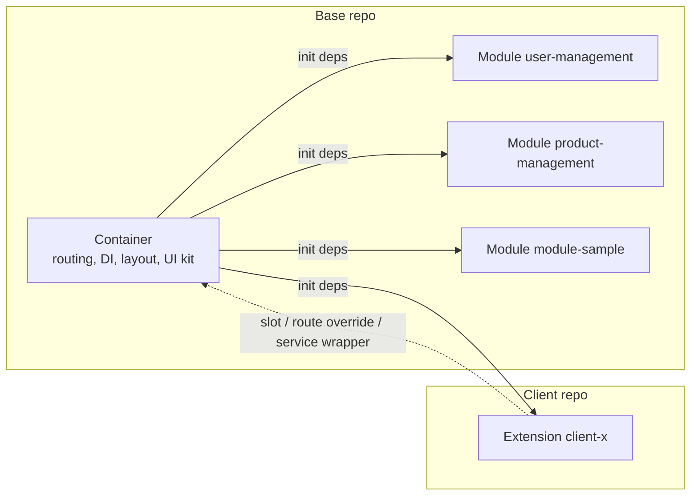
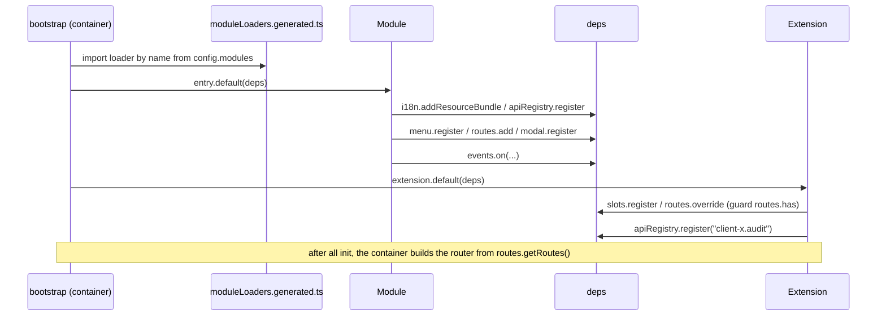
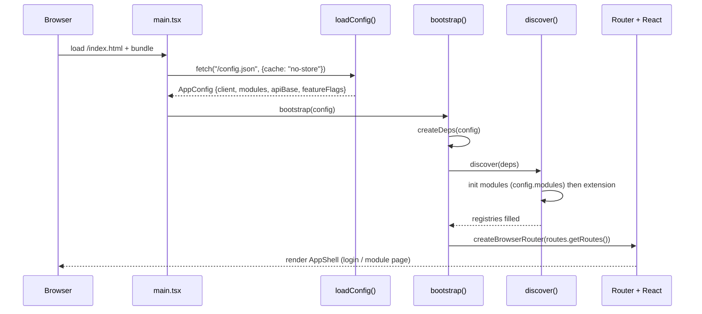
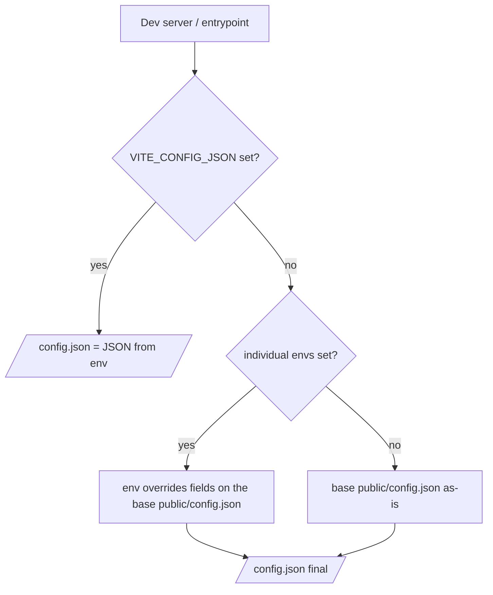
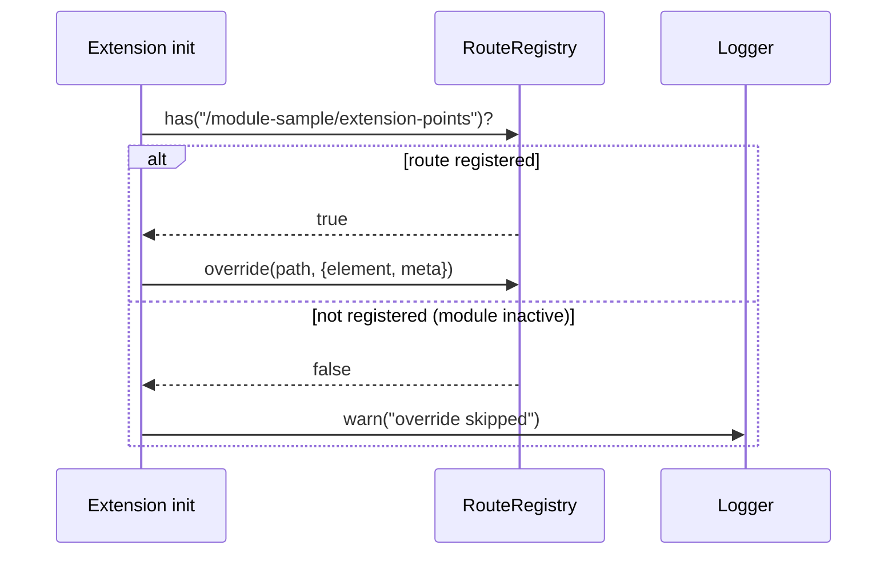
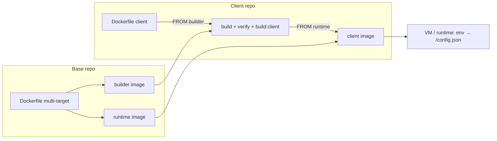
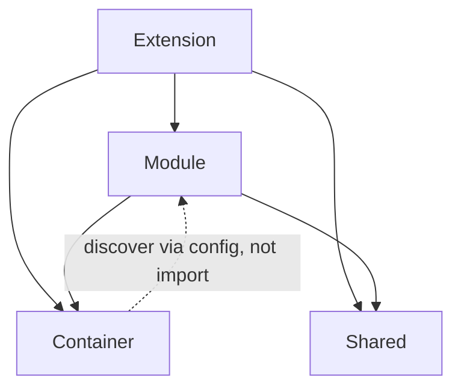

# Architecture Guide — Modular Web Platform

This document explains **how this modular web platform is put together**: one stable *container* (shell), business feature modules selected via config, and one *extension* per client for customization. It targets new developers who already know React hooks and basic TypeScript; every technical term is defined the first time it appears. Part I (§1–§8) provides orientation and dissects each mechanism; Part II (§9–§15) is the working reference. This document explains *how it works*; binding rules (must/must not) live in `CONTRACT`. Indonesian version: `ARCHITECTURE.md`.

**Reader map:**

| If you...                                                            | Start from                        |
| -------------------------------------------------------------------- | --------------------------------- |
| Are new to the project and need the big picture                      | Part I — Orientation (§1–§3)      |
| Need technical detail on one mechanism (DI, routing, slots, build)   | Part I — Mechanisms (§4–§8)       |
| Need a compact reference (layers, patterns, aliases, governance)     | Part II — Reference (§9–§15)      |
| Need normative rules (must/must not)                                 | `CONTRACT`                        |
| Need deployment/operational steps                                    | `DEPLOYMENT-GUIDE`                |
| Need step-by-step code examples                                      | `DEVELOPER-GUIDE`                 |

---

## 1. What Is Built & Why Modular

A modular web platform for **multiple clients**: one codebase is deployed for many clients, with per-client module selection and customization. *Modular* means the app is not built as one monolithic block; it is assembled from three kinds of parts:

| Part          | Role                                                                                                           |
| ------------- | -------------------------------------------------------------------------------------------------------------- |
| **Container** | Application shell: boot, config, dependency injection (DI), auth, routing host, layout, and every registry     |
| **Module**    | Self-contained business feature: pages, menu, services, modals, state, and translations                        |
| **Extension** | Customization for one client: slots, route overrides, service wrappers, extra services and translations        |

Jargon: *dependency injection* (DI) means the container prepares a single object holding all services (called `deps`) and hands it to modules and extensions at boot, so they never create those instances themselves.

**Platform characteristics:**

- React 19 + Vite + TypeScript.
- Multi-client: many clients share the same container and modules; differences live in the extension.
- Dozens of business modules — currently `user-management`, `product-management`, and `module-sample`.
- Backend microservices are reached via **path-based routing** (`/api/<service>`), e.g. the `auth` service at `/api/auth` (`web-container/src/di/deps.ts:45`).
- Per-client deployment: the base is built once as a base image, then each client builds a client image `FROM` that base image (see `DEPLOYMENT-GUIDE` §1).

**A quick example.** The `module-sample` module registers its own pages, menu, service, and modal via `init(deps)` (`web-modules/modules/module-sample/index.tsx:14`). The `client-a` extension never touches that module; it fills the `module-sample.overviewPanel` slot and overrides the `/module-sample/extension-points` route (`web-extension-client-a/src/index.tsx:32`). This pattern repeats throughout the document: **the base provides extension points, the client plugs in**.

### 1.1 Without Modular vs With Modular

| Aspect                              | Without modular                        | With modular                                        |
| ----------------------------------- | -------------------------------------- | --------------------------------------------------- |
| A change for client A               | Can break client B                     | Isolated inside client A's extension                |
| Bundle                              | Every feature is loaded                | Only modules listed in `config.modules`             |
| Onboarding a new client developer   | Must dig through the entire codebase   | Base repo (read) + small extension is enough        |
| Product cadence vs client requests  | Get in each other's way                | Run in parallel: stable base, isolated extension    |

### 1.2 Seven Philosophy Principles

These principles shape every design decision. Their hard rules live in `CONTRACT` §1.

| Principle                          | Meaning                                                    | Consequence                                                                     |
| ---------------------------------- | ---------------------------------------------------------- | ------------------------------------------------------------------------------- |
| **Container doesn't know modules** | The shell never imports module code                        | Modules are found from `config.modules` (discovery), not hardcoded              |
| **Modules don't know extensions**  | A module never mentions a client name                      | Customization goes through slots, not `if (client === 'client-a')`              |
| **Extension knows the base**       | An extension may import the container and module public APIs | The extension has one clear entry point: `init(deps)`                         |
| **Public API as contract**         | Each layer exposes only specific files                     | `@arsi/container`, `@arsi/shared`, `modules/<name>/public.ts` (`CONTRACT` §1.4) |
| **Config-driven**                  | Module selection and URLs come from runtime config         | No hardcoding; config is injected when the container starts                     |
| **Fail-fast**                      | Duplicate service, slot, or route throws immediately       | Mistakes surface at boot, not silently in production                            |
| **One image, many environments**   | Staging/production differ only by env vars at start        | Change API base/modules without rebuilding the image                            |

---

## 2. Repo Map & Ownership

In production there are **two kinds of repos**: one **base repo** owned by the platform team, and one **client repo** per client owned by that client's developer. The tables below map their contents.

**Base repo (`arsi-web-base`):**

| Path                           | Contents                                                                                                                             | Owner         |
| ------------------------------ | ------------------------------------------------------------------------------------------------------------------------------------ | ------------- |
| `web-container/`               | Shell: boot (`src/bootstrap/`), DI (`src/di/deps.ts`), auth, routing host, layout, registries, API client, i18n, toast/modal/notifications | Platform team |
| `web-modules/`                 | `shared/` (UI kit, hooks, utils) + `modules/<name>/` (business features)                                                             | Platform team |
| `web-extension-default/`       | No-op extension used to run the base standalone (`client: "base"`)                                                                   | Platform team |
| `web-extension-template/`      | Starting point for a new client repo                                                                                                 | Platform team |
| `docs/`                        | `ARCHITECTURE`, `CONTRACT`, `DEVELOPER-GUIDE`, `DEPLOYMENT-GUIDE`                                                                    | Platform team |
| `Dockerfile` + `.dockerignore` | Builds 2 base images: builder (`node:22-alpine`) and runtime (`nginx:1.27-alpine`)                                                   | Platform team |
| `ci/build-base.sh`             | Base image build + push script                                                                                                       | Platform team |

**Client repo (`arsi-web-client-<x>`, checkout `web-extension-client-<x>`):**

| Path                      | Contents                                                                              | Owner           |
| ------------------------- | ------------------------------------------------------------------------------------- | --------------- |
| `manifest.json`           | Client identity: `client`, `baseVersion` (exact pin to the base tag), modules, overrides | Client developer |
| `src/index.tsx`           | Entry point `init(deps)` — the extension's only way in                                 | Client developer |
| `src/components/`         | Client-specific components (e.g. `AuditButton`)                                        | Client developer |
| `src/overrides/<module>/` | Per-module overrides (e.g. `user-management/ClientAUserDetail.tsx`)                    | Client developer |
| `Dockerfile`              | Client image: `FROM` base builder → `FROM` base runtime                               | Client developer |
| `ci/build-client.sh`      | Client image build + push script                                                       | Client developer |

> **Sample workspace note.** This repo is a sample workspace with a **flat layout**: `web-container/`, `web-modules/`, `web-extension-default/`, `web-extension-template/`, and `web-extension-client-a/` sit side by side in one folder. In production, `web-extension-client-<x>` is the contents of a separate repo `arsi-web-client-<x>`; during development that repo is checked out next to the base repo because path mapping assumes a *sibling* position (`DEPLOYMENT-GUIDE` Tutorial A).

### 2.1 Who Changes What

| Change                                        | Changed in                     | Discussion needed?       |
| --------------------------------------------- | ------------------------------ | ------------------------ |
| Add/modify a business module                  | `web-modules/modules/<name>`   | No                       |
| Add a shared UI component                     | `web-modules/shared`           | No                       |
| Change the shell, DI, or container public API | `web-container`                | Yes — lead dev           |
| Customize one client                          | `web-extension-client-<x>`     | No                       |
| Bump the `baseVersion` a client uses          | the client's `manifest.json`   | Yes — schedule base adoption |
| Create a new client repo                      | Copy `web-extension-template`  | Yes                      |

Ownership principle: a client developer **may read** the base repo but **may not change it**; base-level needs are proposed via a PR to the platform team. Conversely, the base never touches extension code.

### 2.2 What Is Not in the Client Repo

The client repo intentionally stays small. It does not contain:

- `web-container/` and `web-modules/` — they come from the base builder image at client image build time (`/app/web-container`, `/app/web-modules`).
- `moduleLoaders.generated.ts` — generated by the container from each module's `package.json`, not copied to clients.
- `/config.json` — written by `entrypoint.sh` at container start from env vars (`VITE_*`), not a committed file.
- Other clients' code — there is no cross-client access.

---

## 3. Ten-Minute Mental Model

### 3.1 Building Analogy

Think of the platform as a **building**:

- The **container** is the building plus its shared facilities — structure, electricity, elevators, security. It provides auth, routing, layout, DI, and registries; it does not know what each room holds.
- A **module** is a tenant that furnishes its own room — a business feature (`user-management`, `module-sample`) complete with its pages, menu, services, and state.
- An **extension** is decoration or renovation for one specific client — adding a panel, replacing a page, or wrapping logic, without changing the building's foundation.

### 3.2 Three Terms

| Term          | Short definition                                                                                                                                                            | Example in this repo                             |
| ------------- | --------------------------------------------------------------------------------------------------------------------------------------------------------------------------- | ------------------------------------------------ |
| **Container** | The React application that boots, provides config, DI, auth, routing host, layout, and every registry. Only its public API (`@arsi/container`) may be used by modules/extensions. | `web-container/src/di/deps.ts:23`                |
| **Module**    | A self-contained business feature package that registers menu, routes, services, modals, and i18n via `init(deps)`; its contract is `public.ts`. Selected per client via `config.modules`. | `web-modules/modules/module-sample/index.tsx:14` |
| **Extension** | A per-client customization package that also has `init(deps)`; it fills slots, overrides routes, and adds services/i18n. It is never imported by the base.                  | `web-extension-client-a/src/index.tsx:32`        |

### 3.3 Block Diagram



Key takeaway: **the container calls, modules and extensions register**. At boot, the container creates one `deps` object holding 13 services — `config`, `logger`, `api`, `apiRegistry`, `events`, `i18n`, `queryClient`, `toast`, `modal`, `notifications`, `slots`, `routes`, `menu` (`web-container/src/di/deps.ts:23`) — then `discover()` calls `init(deps)` for every module in `config.modules`, and finally for the extension (`web-container/src/bootstrap/discover.ts:12`). Modules and extensions register themselves when the container calls `init(deps)`; the dotted arrow from the extension shows the *adjustment* direction toward what is already registered, not an extra call from the container.

### 3.4 The Boot Flow on One Screen

```
main.tsx
  └─ loadConfig()            → fetch /config.json
  └─ bootstrap(config)       → createDeps + discover
       ├─ discover()         → init(deps) for each module in config.modules, then the extension
       └─ createBrowserRouter(...) → build routes from the registry
  └─ createRoot(...).render(<RouterProvider router={router} />)
```

The order matters: config is read first, `deps` is created **once**, all `init` calls finish, and only then are the router and React rendered. Each step is detailed in §4–§8.

### 3.5 Where to Start Reading Code

| To see...                              | Open                                              |
| -------------------------------------- | ------------------------------------------------- |
| The app entry point and boot           | `web-container/src/main.tsx:11`                   |
| The `deps` contract (13 services)      | `web-container/src/di/deps.ts:23`                 |
| A complete example module              | `web-modules/modules/module-sample/index.tsx:14`  |
| An example client extension            | `web-extension-client-a/src/index.tsx:32`         |

### 3.6 One Real Flow

An example from this repo — log in as client `client-a`, then browse the app:

| What happens                                   | Who handles it                                                                                                       |
| ---------------------------------------------- | -------------------------------------------------------------------------------------------------------------------- |
| The "Users" menu item appears                  | The `user-management` module registers the menu; the client-a extension overrides the i18n label to "Client A Users"  |
| The user list page (`/users`) opens            | A route owned by the `user-management` module; the extension adds an audit button via the `user-management.userTableActions` slot |
| The user detail page (`/users/:id`) opens      | The route is overridden by the client-a extension → the `ClientAUserDetail` component                                 |
| The `/module-sample/extension-points` page opens | The route is overridden by the extension; a panel on that page is also filled via the `module-sample.overviewPanel` slot |

Everything the client "added" happens without changing module code. That is the payoff of this architecture.

Next: §4–§8 covers the boot sequence, the `deps` contract in detail, routing, slots, overrides, and finally build and deployment.

---

## 4. Modular Mechanism In Depth

§1–§3 gave the big picture. This part dissects, one by one, the mechanisms modules and extensions use to plug into the container. They all rest on the same pattern: a **registry** — a name → data map object — that the container creates once at boot and hands over through `deps`; modules and extensions register, and the container reads the contents after all init calls finish.

### 4.1 Discovery & Loader Map

*Discovery* means the container finds modules from runtime data (`config.modules`), not from a hardcoded list of `import`s. Between a module name and its code sits a **loader map** of dynamic imports:

```ts
// web-container/src/bootstrap/moduleLoaders.generated.ts:12
export const moduleLoaders: Record<string, () => Promise<ModuleEntryPoint>> = {
  'module-sample': () => import('@arsi/module-module-sample/entry'),
  'product-management': () => import('@arsi/module-product-management/entry'),
  'user-management': () => import('@arsi/module-user-management/entry'),
};
```

This file is **generated**: `scripts/generate-module-loaders.mjs` builds it from each module's `package.json` via `npm run gen:modules`; never edit it by hand. The `predev`, `pretypecheck`, `pretest`, and `prebuild` hooks run it automatically (`web-container/package.json:10-23`).

The loop lives in `discover()`:

```ts
// web-container/src/bootstrap/discover.ts:13
for (const moduleName of deps.config.modules) {
  const load = moduleLoaders[moduleName];
  if (!load) {
    throw new Error(
      `[bootstrap] module "${moduleName}" is declared in config.modules but is not wired in moduleLoaders.generated.ts (run \`npm run gen:modules\`)`,
    );
  }
  const entry = await load();
  await entry.default(deps);
  deps.logger.info(`module "${moduleName}" initialized`);
}
```

Key points:

- Init order follows the order of names in `config.modules`.
- A name in config with no loader in the map → **fail-fast**: boot stops with a message telling you to run `npm run gen:modules` (`discover.ts:16`). A missing feature due to misconfiguration is better surfaced at boot than discovered silently in production.
- After all modules, `discover()` loads the extension through the `@arsi/extension` alias (`discover.ts:10`; mapped at build time to `web-container/current-client/src/index.tsx`, `aliases.cjs:21-24`) and calls `extension.default(deps)` (`discover.ts:26`). The extension **always inits last**; this order is what makes route overrides (§4.4) valid.

### 4.2 `deps` — The Single Services Object (DI)

`deps` is the only channel between the container and module/extension code. `createDeps(config)` (`web-container/src/di/deps.ts:39`) creates it once at boot (`web-container/src/bootstrap/index.tsx:19`), then the same object is handed to every `init(deps)`. It holds 13 services (`web-container/src/di/deps.ts:23`):

| Field           | Purpose                                                                             |
| --------------- | ----------------------------------------------------------------------------------- |
| `config`        | `AppConfig` produced by `loadConfig()`: `client`, `modules`, `apiBase`, `featureFlags` |
| `logger`        | Client-prefixed logger; level `debug` in dev, `info` in production                  |
| `api`           | Base axios instance for the platform backend                                        |
| `apiRegistry`   | Per-name service registry (§4.5); the core `auth` service is pre-registered         |
| `events`        | Cross-module event bus (§4.7)                                                       |
| `i18n`          | i18next instance; `addResourceBundle` registers per-namespace translations          |
| `queryClient`   | React Query query client                                                            |
| `toast`         | Toast service (lightweight, self-dismissing notifications)                          |
| `modal`         | Modal registry + controls (§4.6)                                                    |
| `notifications` | Persistent notification service                                                     |
| `slots`         | UI slot registry (§4.3)                                                             |
| `routes`        | Host route registry (§4.4)                                                          |
| `menu`          | Sidebar menu registry (§4.6)                                                        |

The only registration `createDeps` performs itself is the core `auth` service:

```ts
// web-container/src/di/deps.ts:45
apiRegistry.register('auth', createServiceClient('/api/auth'));
```

Modules and extensions **never** create their own i18n, router, or query client instances — they receive `deps` and register into it.

### 4.3 Slot — UI Extension Point

A **slot** is a named placeholder in the UI that a component from outside the module can fill. Three steps:

**1. The module declares the slot name.** The name lives in `slots.ts` and is exported through `public.ts` so extensions can import it (`web-modules/modules/module-sample/public.ts:8`):

```ts
// web-modules/modules/module-sample/slots.ts:2
export const sampleSlots = {
  overviewPanel: 'module-sample.overviewPanel',
} as const;
```

The convention is `<module>.<slot>` so names cannot collide across modules.

**2. The module's component consumes the slot** through the `useSlot` hook from `@arsi/container`:

```tsx
// web-modules/modules/module-sample/pages/SampleExtensionPage.tsx:11
const Panel = useSlot<{ label?: string }>(sampleSlots.overviewPanel);
```

`useSlot` only reads the registry (`web-container/src/hooks/useSlot.ts:5`; exported from `web-container/src/public/index.ts:16`). When nothing has filled the slot yet, it returns `undefined` and the module renders its own fallback (`SampleExtensionPage.tsx:49`).

**3. The extension fills the slot** via `deps.slots.register(name, component)` — e.g. `AuditButton` for `userSlots.userTableActions` (`web-extension-client-a/src/index.tsx:62`) and `ClientASamplePanel` for `sampleSlots.overviewPanel` (`:70`):

```tsx
// web-extension-client-a/src/index.tsx:70
deps.slots.register(sampleSlots.overviewPanel, ClientASamplePanel);
```

A slot may hold only **one** component: a second registration throws `[slots] slot "..." already has a component registered` (`web-container/src/slots/slotRegistry.ts:17`). `get` and `has` (`:21`, `:24`) cover reads. The rule of the game: the module declares, the extension fills, and the module never knows who filled it.

### 4.4 Route — Host Route Registry

Modules register routes via `deps.routes.add({ path, element, meta })`:

```tsx
// web-modules/modules/module-sample/index.tsx:36
deps.routes.add({
  path: '/module-sample',
  element: <SampleOverviewPage />,
  meta: { group: 'sample', module: 'module-sample' },
});
```

- `meta.module` is **required** — the host uses it to tie a route to its owning module (and `group` for navigation grouping).
- A duplicate path → error `[routes] route "..." is already registered` (`web-container/src/routes/routeRegistry.ts:27`). Without this rule, two modules could silently overwrite each other's pages.
- Extensions adjust routes with `override(path, { element, meta })`; this is only allowed for an already-registered path, otherwise → error `[routes] cannot override unknown route "..."` (`routeRegistry.ts:33`).

Because the same extension may be installed for clients with a different subset of modules, it checks with `has(path)` first. The `overrideIfPresent` pattern in client-a:

```tsx
// web-extension-client-a/src/index.tsx:25
if (!deps.routes.has(path)) {
  deps.logger.warn(`[client-a] route "${path}" belum terdaftar; override dilewati`);
  return;
}
deps.routes.override(path, definition);
```

If the `user-management` module is not in `config.modules`, the `/users/:id` override is skipped with a warning instead of failing boot.

The container builds the router from `getRoutes()` **after** discovery: module routes are attached as children under `/` (behind `ProtectedRoute` + `AppShell`, `web-container/src/bootstrap/index.tsx:28-41`), with the leading slash stripped during mapping (`bootstrap/index.tsx:23`). The full flow is in §5.

**Dynamic routes & query strings.** The registry stores the path **as a string** (`web-container/src/routes/routeRegistry.ts:22-29`); at boot, the container maps every registered path to React Router by stripping the leading `/` and passing it to `createBrowserRouter` (`web-container/src/bootstrap/index.tsx:22-26`).

- React Router v6 matches `:id` dynamic segments natively; static patterns beat dynamic ones. Pages read params via `useParams` — real example: `/users/:id` registered at `web-modules/modules/user-management/index.tsx:42` and read in `web-modules/modules/user-management/pages/UserDetailPage.tsx:12`.
- `has`/`override` match the **exact string**: an extension overriding a dynamic route writes the same pattern (`'/users/:id'`, e.g. `web-extension-client-a/src/index.tsx:64`), never a concrete URL.
- Query strings (`/users?state=online`) are never part of registration or route matching. Pages read them with `useSearchParams`, then pass the values to services/React Query keys; there is no example in this sample yet.
- Deploy: the nginx SPA fallback (`try_files $uri $uri/ /index.html`, `web-container/nginx.conf:18`) serves any deep link, and the browser preserves the query string.

```tsx
// Dynamic page: params from the path, filters from the query string.
const { id } = useParams<{ id: string }>();
const [searchParams] = useSearchParams();
const state = searchParams.get('state');
```

### 4.5 Service Registry (`apiRegistry`)

Services with their own client are registered in a named registry so modules never import each other's axios instances. A module registers its own instance:

```ts
// web-modules/modules/module-sample/index.tsx:23
const sampleClient = axios.create({
  baseURL: deps.config.apiBase,
  timeout: 8000,
});
deps.apiRegistry.register('module-sample', sampleClient);
```

- A module's service name is not always the module name: follow `CONTRACT` §4.6 — `user-management` → `user`, `product-management` → `product`, `module-sample` → `module-sample`.
- Extension convention: **client name prefix** — `<client>.<service>` — e.g. `deps.apiRegistry.register('client-a.audit', auditClient)` (`web-extension-client-a/src/index.tsx:60`). That makes it impossible for an extension service to collide with a base service.
- The core `auth` service is registered by the container (`web-container/src/di/deps.ts:45`).
- Duplicate → error `[apiRegistry] service "..." is already registered` (`web-container/src/api/apiRegistry.ts:15`); `get(name)` throws for an unknown name (`:22`); `has` is available for checks.
- In components, the registry is read through `useApiRegistry` from `@arsi/container` (`web-container/src/public/index.ts:4`), for example `SampleExtensionPage.tsx:14`.

### 4.6 Menu & Modal

**Menu.** The host sidebar is built from `deps.menu.getAll()`. A module registers one item per main page:

```ts
// web-modules/modules/module-sample/index.tsx:29
deps.menu.register({
  path: '/module-sample',
  label: 'menu.root',
  namespace: 'module-sample',
  order: 30,
});
```

`label` is an **i18n key**, not final text; `namespace` points at the translation bundle the module registered in `index.tsx:20`, so labels follow the active language. `getAll()` returns items sorted by `order` ascending (`web-container/src/menu/menuRegistry.ts:23`). A duplicate path → error `[menu] menu item "..." is already registered` (`:19`).

**Modal.** A modal is a React component the host renders when opened, with an arbitrary payload:

```ts
// web-modules/modules/module-sample/index.tsx:50
deps.modal.register(sampleModals.info, SampleInfoModal);
```

`sampleModals.info` equals `'module-sample.info'` (`web-modules/modules/module-sample/modals.ts:2`) — the `<module>.<modal>` convention. A modal component receives `{ payload, close }` props (`web-container/src/modal/modalService.ts:3`); open it via `deps.modal.open(name, payload)` (`:42`) or the `useModal` hook (`web-container/src/public/index.ts:11`). A duplicate name → error `[modal] "..." is already registered` (`modalService.ts:38`).

### 4.7 Event Bus — Communication Without Coupling

`deps.events` is a simple **event bus** (publish–subscribe): a sender calls `emit(name, payload)` and every handler registered via `on(name, handler)` is invoked — neither side knows the other. The implementation is a `Map<string, Set<handler>>` (`web-container/src/events/eventBus.ts:11`); `on` returns an unsubscribe function (`:18`). Inside components, the same bus is reached through the `useEventBus` hook (`web-container/src/public/index.ts:5`), which returns `deps.events` (`web-container/src/hooks/useEventBus.ts:5`).

```tsx
// web-modules/modules/user-management/hooks/useUser.ts:75 — publisher (emit)
events.emit(userEvents.updated, { id: user.id, changes: input.changes });
```

```tsx
// web-extension-client-a/src/index.tsx:78 — subscriber
deps.events.on<UserUpdatedPayload>(userEvents.updated, (payload) => {
  void deps.queryClient.invalidateQueries({ queryKey: userKeys.detail(payload.id) });
});
```

Event names are always namespaced (`module-sample.sample.postCreated`, `web-modules/modules/module-sample/events.ts:2`) and payload types are exported through `public.ts`, so the receiving side never needs to know the module's internals. This is the main channel for cross-module actions — e.g. the client-a extension refreshes its React Query cache when the `user-management` module `emit`s `userEvents.updated`. Details in §10.

**Init order at a glance.** This diagram summarizes who calls what:



---

## 5. End-to-End Boot Sequence

Here is the full journey from the browser opening the app to React rendering, in six steps:

1. **The browser loads the bundle.** `/index.html` and the built JS bundle load; the entry point is `main()` in `web-container/src/main.tsx:11`.
2. **Config is read.** `loadConfig()` calls `fetch('/config.json', { cache: 'no-store' })` (`web-container/src/config/loadConfig.ts:25`) and normalizes the body into `AppConfig`: `{ client, modules, apiBase, featureFlags }`.
3. **`deps` is created.** `main.tsx:13` calls `bootstrap(config)`; inside, `createDeps(config)` creates `deps` once (`web-container/src/bootstrap/index.tsx:19`) — including the core `auth` service (`web-container/src/di/deps.ts:45`) — then `discover(deps)` (`:20`).
4. **Modules & extension init.** `discover()` imports and calls `init(deps)` for each name in `config.modules` in config order, then the extension last (`web-container/src/bootstrap/discover.ts:13-27`). Every registry is filled during this step.
5. **The router is built.** `bootstrap` maps `deps.routes.getRoutes()` into `RouteObject`s, attaches them as children under `/` (behind `ProtectedRoute` + `AppShell`), then adds `/login`, the `HomePage` index, and the `*` `NotFoundPage` fallback (`bootstrap/index.tsx:22-41`).
6. **Render.** `main.tsx:20` runs `createRoot(...).render(<AppProviders deps={deps}><RouterProvider router={router} /></AppProviders>)`. `AppProviders` exposes `deps` through React context — the origin of every hook such as `useSlot` — and the router shows the login page or a module page according to auth state.



**Three things to underline.**

- **Failed config → fallback, not a crash.** If `fetch` fails (missing file, network trouble, invalid JSON), `loadConfig` logs a warning and uses `DEFAULT_CONFIG`: `{ client: 'default', modules: [], apiBase: '', featureFlags: {} }` (`web-container/src/config/loadConfig.ts:31`, `web-container/src/config/types.ts:8`). The app still boots as a shell without modules. Fail-fast applies to *wiring* mistakes in code, not to runtime config that may be absent in some environment.
- **Bad wiring → fail-fast.** Boot stops with a clear message for: a module not wired in the loader map (`discover.ts:16`), a duplicate route (`routeRegistry.ts:27`), an override of an unknown route (`routeRegistry.ts:33`), and duplicate slot/service/menu/modal (`slotRegistry.ts:17`, `apiRegistry.ts:15`, `menuRegistry.ts:19`, `modalService.ts:38`).
- **The extension is always last.** Because every module finishes init first, module routes already exist when the extension overrides them — this order is what makes overrides valid. `bootstrap` also memoizes its promise (`bootstrap/index.tsx:46-52`), so `deps` and the router are created only once per page load.

---

## 6. Config & Runtime Behavior

§5 already showed `loadConfig()` reading `/config.json` at boot. This section explains **where that file's content comes from** — the dev server or a container entrypoint (the script run automatically when the container starts) — and the winning order when several sources are set at once. Config here is **runtime**, not build-time: the same bundle can run in different environments just by changing env vars at start.

### 6.1 The `AppConfig` Shape

A valid `/config.json` body is normalized into `AppConfig` (`web-container/src/config/types.ts:1`):

| Field          | Contents                                                 | Used for                                          |
| -------------- | -------------------------------------------------------- | ------------------------------------------------- |
| `client`       | Client name                                              | Logger message prefix; client identity at runtime |
| `modules`      | List of active module names                              | Discovery: its order sets init order (§4.1)       |
| `apiBase`      | Backend base URL                                         | Module HTTP services (`axios`, §4.5)              |
| `featureFlags` | Optional runtime boolean flags, e.g. `enableAuditLive`   | Toggle features without a rebuild                 |

Normalization (`normalizeConfig`, `web-container/src/config/loadConfig.ts:3`) enforces types: a field of the wrong type is replaced with its default (`client: 'default'`, `modules: []`, `apiBase: ''`, `featureFlags: {}`, `types.ts:8`). If `fetch` fails entirely, `loadConfig` uses `DEFAULT_CONFIG` and the app boots as a module-less shell (details in §5).

Modules and extensions **must not** read env vars or fetch `/config.json` themselves; everything goes through `deps.config` / `useConfig()` (`CONTRACT` §14.3).

### 6.2 Dev: the Dev Server Generates `/config.json`

When `npm run dev` runs in `web-container`, the `devConfigPlugin` (apply `serve`, `web-container/vite.config.ts:22`) intercepts requests for `/config.json`, including the browser's request at boot. Env comes from `.env` files plus the process environment (`loadEnv(mode, rootDir, '')`, `:24`), and the response is always `Cache-Control: no-store` (`:41`).

Winning order, strongest first:

1. **`VITE_CONFIG_JSON` — full override.** The whole config comes from this env value; other individual envs are ignored. It must be a JSON object (starts with `{`, ends with `}`); otherwise the dev server responds HTTP 500 with `[dev-config] VITE_CONFIG_JSON must be a JSON object (start with '{' and end with '}')` (`web-container/scripts/dev-config.mjs:34-38`).
2. **Individual env vars** — override fields on top of the base:
   - `VITE_MODULES` — a CSV (comma-separated list) that **replaces** the whole module list (`dev-config.mjs:55`);
   - `VITE_API_BASE` — replaces `apiBase` (`:56`);
   - `VITE_ENABLE_AUDIT_LIVE` — sets `featureFlags.enableAuditLive`; `false` turns it off, any other non-empty value turns it on (`:60`).
3. **`public/config.json`** — the committed base; fields not overridden by env are taken as-is. In this repo it holds `client-a` + three modules (`web-container/public/config.json:1`).
4. **Defaults** — used when the base is missing or a field is empty: modules `['user-management']`, apiBase `https://dummyjson.com` (`dev-config.mjs:4-5`).

The client id in dev is resolved from the `current-client` symlink or `.env` (`resolveClientId`). When there is no client and `VITE_CONFIG_JSON` is empty too, the dev server serves the raw `public/config.json` (`vite.config.ts:43-50`).

### 6.3 Production: the Container Entrypoint Writes `/config.json`

In production images, `/config.json` is **written at container start** by `entrypoint.sh`, which the runtime image installs as `/docker-entrypoint.d/40-generate-config.sh` (`Dockerfile:40`). The script reads env vars and writes `/usr/share/nginx/html/config.json` — the path can be changed via `CONFIG_FILE` (`web-container/docker/entrypoint.sh:4`).

| Container runtime env    | Effect                                      | Default                 |
| ------------------------ | ------------------------------------------- | ----------------------- |
| `VITE_CLIENT`            | `client` field                              | `base`                  |
| `VITE_MODULES` (CSV)     | `modules` field (joined into a JSON array)  | `user-management`       |
| `VITE_API_BASE`          | `apiBase` field                             | `https://dummyjson.com` |
| `VITE_ENABLE_AUDIT_LIVE` | `featureFlags.enableAuditLive`              | `true`                  |
| `VITE_CONFIG_JSON`       | Full override: config body written verbatim | empty                   |

`VITE_CONFIG_JSON` wins completely: individual envs are ignored (logged, `entrypoint.sh:21`); if the value is not a JSON object → `exit 1` and the container fails to start (`:16-17`).

The consequence is exactly the **one image, many environments** principle (§1.2): changing the API base, module list, or flags is just env at `docker run`, with no rebuild. What is still fixed at image build time is **which client extension is included** (covered in §8); `VITE_CLIENT` only fills the client name in config.

### 6.4 Config Resolution Order



Two runtimes are merged in the diagram: the **dev server** uses `public/config.json` as its base (§6.2), while the **production entrypoint** always rewrites that file from env/defaults (§6.3) — the bundled copy of `public/config.json` is never used as a base. The outcome is the same: one final `/config.json` read by `loadConfig()` at boot.

Two different failure modes: in production, an invalid `VITE_CONFIG_JSON` fails **container start** (fail-fast); in the browser, a config that fails to fetch only falls back to `DEFAULT_CONFIG` and the app still boots (§5).

---

## 7. The 3 Override Levels + Guard

An extension customizes the app without touching container or module code. There are three levels, from safest to most invasive:

| # | Level           | API                                                       | Nature                                                                    | Example in this repo                                                                           |
| - | --------------- | --------------------------------------------------------- | ------------------------------------------------------------------------- | ---------------------------------------------------------------------------------------------- |
| 1 | Slot            | `deps.slots.register(name, component)`                    | Additive: only adds a component at an extension point the module provides | `AuditButton` fills `userSlots.userTableActions` (`web-extension-client-a/src/index.tsx:62`)   |
| 2 | Route override  | `deps.routes.override(path, {element, meta})`             | Replaces the whole route entry                                            | `/users/:id` → `ClientAUserDetail` (`:64`)                                                     |
| 3 | Service wrapper | `deps.apiRegistry.register('<client>.<service>', client)` | Adds a new client-namespaced service                                      | `client-a.audit` (`:60`)                                                                       |

Jargon: **additive** means it can only add, never remove; **invasive** means it changes already-registered behavior.

- **Level 1 — slot.** A UI extension point declared by a module (§4.3). The safest because it changes nothing that already exists. Its limit: one slot holds only one component — a second registration throws `[slots] slot "..." already has a component registered` (`web-container/src/slots/slotRegistry.ts:17`).
- **Level 2 — route override.** `override(path, {element, meta})` replaces the **whole entry**, not just the fields you pass; the path itself cannot be changed via override. Pass `meta` again (e.g. `{ group, module }`) so module attribution is not lost. Without a guard, overriding a path that is not registered throws `[routes] cannot override unknown route "<path>"` (`web-container/src/routes/routeRegistry.ts:33`).
- **Level 3 — service wrapper.** The service registry has no concept of overriding, so an extension registers a **new** name namespaced as `<client>.<service>` (`CONTRACT` §4.5); that makes a collision with a base service impossible. Core services (`auth`, `user`) are registered by the base (`auth` at `web-container/src/di/deps.ts:45`) and **must not** be overridden by extensions. A duplicate name → error `[apiRegistry] service "..." is already registered` (`web-container/src/api/apiRegistry.ts:15`).

### 7.1 Guard for Optional Modules

The same extension may be installed for clients with a different module subset. A route override targets a module route; if that module is not active in `config.modules`, its route never gets registered. A blind `override` would fail boot, so `CONTRACT` §12.4 requires extensions to check `routes.has(path)` first — skip with `logger.warn` when absent — or to guarantee the module is always active.

Init order helps here: the extension always inits **after** every module (§4.1), so the registry is final by the time the guard runs.

The `overrideIfPresent` pattern in client-a:

```tsx
// web-extension-client-a/src/index.tsx:20
function overrideIfPresent(
  deps: Deps,
  path: string,
  definition: Parameters<Deps['routes']['override']>[1],
): void {
  if (!deps.routes.has(path)) {
    deps.logger.warn(`[client-a] route "${path}" belum terdaftar; override dilewati`);
    return;
  }
  deps.routes.override(path, definition);
}
```

Its usage (`index.tsx:64`, `:73`) follows this shape:

```tsx
overrideIfPresent(deps, '/users/:id', {
  element: <ClientAUserDetail />,
  meta: { group: 'user', module: 'user-management' },
});
```



When an override is skipped, the app still runs with the module's default page — only that customization is missing. If boot fails with `[routes] cannot override unknown route`, the cause is usually a typo in the path or a module missing from `config.modules`.

---

## 8. Deploy Model: Base Image + Extension Image

The deploy model follows the two repo kinds from §2: the platform team builds a **base image** once per version, then the client developer builds a **client image** on top. The client repo does **not** check out the base repo — base sources come from the builder image, as noted in §2.2.

### 8.1 Base Image — Multi-Target `Dockerfile`

The root `Dockerfile` has several targets (Docker multi-stage: one Dockerfile with named build stages): **builder** holds the toolchain + sources + `node_modules`, and **runtime** holds nginx + the built assets.

- **`builder` target** (`Dockerfile:5`) — `FROM node:22-alpine`; copies each package's `package.json`/lockfile then `npm ci` (`:18-20`), copies sources (`:22-24`), and writes the base version to `/app/BASE_VERSION` (`:26`). A new module must be added to the `COPY` list here (a reminder comment sits at `:12`).
- **`runtime` target** (`:35`) — `FROM nginx:1.27-alpine`; copies `dist/base` to `/usr/share/nginx/html`, `nginx.conf`, and the config entrypoint (§6.3) (`:38-41`).
- **Intermediate `base-app` target** (`:28`) — runs `npm run check:base` then `CLIENT=base npm run build:client`; the base build is validated against itself before entering runtime.

`ci/build-base.sh` builds both targets and applies **tags** (image version labels): `<version>-builder`, `<sha>-builder`, `<version>`, `<sha>` (`ci/build-base.sh:21-31`). The default version comes from `web-container/package.json`, the `sha` from the commit (`:6-7`). With `PUSH=1` all four tags are pushed (`:33-38`); with `VERIFY=1` typecheck/test/lint run before the build (`:10-17`).

### 8.2 Client Image — `FROM` Base Builder & Runtime

`web-extension-client-a/Dockerfile` assembles the client image from the two base images:

1. `FROM ${BASE_BUILDER_IMAGE} AS builder` (`:7`) — `npm ci` for the extension then copy its source to `/app/extension` (`:11-13`).
2. Symlink `current-client` to the extension (`:15`) — the build-time alias that selects the active extension (§4.1).
3. Verify the extension: `typecheck`, `test --if-present`, `lint` (`:16`).
4. `npm run check:base` then `CLIENT=<client> npm run build:client` (`:17-19`) — producing `dist/<client>` inside the builder.
5. `FROM ${BASE_RUNTIME_IMAGE} AS runtime` (`:21`) — replace the html root with `dist/<client>` (`:24-25`) and set `ENV VITE_CLIENT=<client>` (`:26`).

The key point: there is no `COPY` of modules or base sources from the client repo — they all come from the builder image (`/app/web-container`, `/app/web-modules`, noted in §2.2). The client repo carries only extension code.

`ci/build-client.sh` takes `BASE_VERSION` from `manifest.json:baseVersion` (`:6`), pulls both base images (default `PULL=1`, `:14-17`), builds tagged with the build id (`BUILD_ID`, default git short SHA), and pushes when `PUSH=1` (`:21-30`).

### 8.3 Pinning `baseVersion` & Adopting a New Base

`manifest.json:baseVersion` pins the **exact tag** of the base a client uses (in this repo `0.1.0`, `web-extension-client-a/manifest.json:3`). At client build time, `check:base` compares the manifest value against `/app/BASE_VERSION` in the builder image; a mismatch → error telling you to bump `baseVersion` or use the right base tag (`web-container/scripts/check-base-version.mjs:29-34`). A client build therefore cannot silently use the wrong base.

Adopting a new base = a PR in the client repo bumping `baseVersion`, then rebuilding the client image. There is no base checkout step on the client side.

### 8.4 Build & Runtime Flow



Once the client image exists, it behaves like the base at runtime: the entrypoint writes `/config.json` from env at container start (§6.3), so the same image can serve several environments.

Full operational steps — build, push, run, smoke test — live in `DEPLOYMENT-GUIDE`: **Tutorial A** (deploy on a local laptop), **Tutorial B** (deploy on an Ubuntu server), and **Tutorial C** (deploy via Azure CI/CD).

---

## Part II — Reference

Part I builds the mental model; Part II is a **working reference**: a summary of each mechanism with pointers to its normative rules. The code in this repo is the final word, mandatory rules live in `CONTRACT`, and hands-on steps live in `DEVELOPER-GUIDE`.

## 9. Layers & Dependency Rules

There are four code layers — container, shared, module, extension — and **dependencies may only flow one way, downward**: the extension knows the base, the base never knows the extension or modules directly.



| Rule | Meaning |
| --- | --- |
| Container never imports modules/extensions | Modules are discovered from `config.modules` through the loader map (§4.1) |
| Modules never import other modules | Communicate through the event bus (§10.3); import genuinely public APIs from that module's `public.ts` |
| Shared never imports container/modules | `@arsi/shared` is pure components/hooks/utils |
| Container stays self-contained | The container must not import `@arsi/shared`; shell styling uses its own tokens (`CONTRACT` §9.4) |
| Imports only from public APIs | `@arsi/container`, `@arsi/shared`, and a module's `public.ts` (`CONTRACT` §1.4) |

Full rules and the dependency matrix: `CONTRACT` §1; how to access services outside and inside the React tree: `CONTRACT` §2.

## 10. State, Data Fetching, Events, UI

The six patterns below appear in almost every module. In `init(deps)` use the `deps` object; inside components use hooks from `@arsi/container` (`CONTRACT` §2.1).

### 10.1 Per-module state — Zustand

Each module owns its store for **UI state** (filters, page, selected item); the container owns the global stores (`auth`, `theme`, `locale`). A module store is exported through `public.ts` so extensions may use it — other modules still may not.

```ts
// web-modules/modules/user-management/store/useUserStore.ts:16
export const useUserStore = create<UserUiState>()(
  devtools(
    persist((set) => ({ search: '', page: 1, /* ... */ }), { name: 'module:user-management' }),
    { name: 'user-management', enabled: isDev },
  ),
);
```

Persist keys must be namespaced `<layer>:<name>`. Full rules: `CONTRACT` §3.

### 10.2 Data fetching — React Query + service factory

API data → React Query; pure UI state → Zustand. A service must be a *factory function* — it takes an axios instance and returns the service object — so it never touches `deps` and is easy to test.

```ts
// web-modules/modules/user-management/hooks/useUser.ts:17-29
function useUserService() {
  const apiRegistry = useApiRegistry();
  return useMemo(() => createUserService(apiRegistry.get('user')), [apiRegistry]);
}

export function useUserList(params?: UserListParams) {
  const service = useUserService();

  return useQuery({
    queryKey: userKeys.list(params),
    queryFn: () => service.list(params),
  });
}
```

Per-module query keys live in `queryKeys.ts`, are namespaced, and are exported through `public.ts` so extensions can invalidate the cache. Only the container creates the `QueryClient`; every mutation invalidates the relevant keys. Full rules: `CONTRACT` §5.

### 10.3 Event bus — cross-module communication

Senders call `emit(name, payload)`; listeners register with `on(name, handler)`, and neither side knows the other. Event names are namespaced `<module>.<entity>.<action>`; payload types are exported through `public.ts`.

```ts
// module sends
events.emit(userEvents.updated, { id, changes });
// extension listens (registered in init)
deps.events.on<UserUpdatedPayload>(userEvents.updated, (payload) => {
  void deps.queryClient.invalidateQueries({ queryKey: userKeys.detail(payload.id) });
});
```

Modules must not listen to extension events. Full rules: `CONTRACT` §13.

### 10.4 i18n — one namespace per module

Each module registers its `en`/`id` bundles under its own namespace; extensions may override a module bundle with a *deep merge* (matching keys are overwritten, the rest kept) but not the container's built-in namespaces without agreement. UI text always uses i18n keys, never hardcoded strings.

```ts
deps.i18n.addResourceBundle('en', 'user-management', en);
const { t } = useTranslation('user-management');
```

Full rules: `CONTRACT` §6.

### 10.5 Toast, modal, notifications

Three feedback channels owned by the container: `toast` (transient messages), `modal` (dialogs that receive `{ payload, close }`), and `notifications` (the persistent bell in the Topbar). Modal names are namespaced `<module>.<action>` and registered in `init`, not in a component.

```ts
deps.modal.register(sampleModals.info, SampleInfoModal);
deps.modal.open(sampleModals.info, payload);
toast.success(t('create.success')); // from useToast()
```

Full rules: `CONTRACT` §7–§8.

### 10.6 UI kit & styling

Shared UI components live in `web-modules/shared` and are imported from `@arsi/shared`; modules/extensions must not import `components/ui/*` directly or create their own Tailwind config. Components that are very module-specific may stay in the module. The container is **self-contained**: it does not import `@arsi/shared` and uses its own color tokens (ARSI Purple `#551AB9` in CSS variables). Adding a component:

```bash
cd web-modules/shared && npx shadcn@latest add <component>
```

Full rules: `CONTRACT` §9–§10.

## 11. Path Mapping & Aliases

Cross-package imports use aliases instead of relative paths. Two definitions must stay in sync: `web-container/aliases.cjs` (used by Vite) and `web-container/tsconfig.json:paths` (used by TypeScript/ESLint, since tsconfig cannot read `.cjs`).

| Alias | Resolves to | Used by |
| --- | --- | --- |
| `@arsi/container` | `web-container/src/public/index.ts` | modules & extensions |
| `@arsi/shared` | `web-modules/shared/index.ts` | modules & extensions |
| `@arsi/module-*` | `web-modules/modules/*/public.ts` | extensions (module contract) |
| `@arsi/module-*/entry` | `web-modules/modules/*/index.tsx` | container loader map (§4.1) |
| `@arsi/extension` | `web-container/current-client/src/index.tsx` | container (active extension) |

Both `@arsi/module-*` patterns are **wildcards** (a `*` pattern matching any module name): adding a module requires no alias changes. Order matters — the `/entry` pattern is written before the base pattern so the base pattern does not capture it (`aliases.cjs:9-15`). `current-client` is a symlink to the active extension (dev: `CLIENT=client-a npm run link:client`; in the builder image it points to `/app/extension`).

The loader map `web-container/src/bootstrap/moduleLoaders.generated.ts` is generated by `npm run gen:modules` from each module's `package.json` — never edit it manually (§4.1). Full alias rules: `CONTRACT` §1.5.

## 12. Build & Deployment (Details)

The base + client image model is in §8; this section covers commands and runtime behavior.

**Scripts in `web-container/package.json`:**

| Script | Purpose |
| --- | --- |
| `gen:modules` | regenerate the loader map from `web-modules/modules/*/package.json` |
| `dev` | dev server; `/config.json` is generated from env (§6.2) |
| `build` | build using the client from the `current-client` symlink |
| `build:client` | build for a specific client; env `CLIENT` is **required** (output `dist/<client>`) |
| `check:base` | compare `manifest.json:baseVersion` with `/app/BASE_VERSION` (§8.3) |
| `check:dockerfile` | ensure every `package.json` is `COPY`ed in the `Dockerfile` |
| `test:entrypoint` | test `entrypoint.sh` (`/config.json` writing) |
| `typecheck`, `test`, `lint` | standard verification before a PR |

Pre-hooks `predev`, `prebuild`, `prebuild:client`, `pretypecheck`, `pretest` run `gen:modules` automatically; do not call `vite build` directly or the loader map may go stale.

**Root Dockerfile** (multi-target; details in §8.1): `builder` (Node 22 + sources + `node_modules` + `/app/BASE_VERSION`), `base-app` (builds the default `client: base`), `runtime` (nginx 1.27 + `dist/base` + `nginx.conf` + entrypoint). A new module must add its `COPY` line; `check:dockerfile` enforces this.

**Entrypoint & nginx.** On container start, `entrypoint.sh` writes `/config.json` from the `VITE_*` env (§6.3). `nginx.conf` serves the SPA:

| Location | Behavior | Why |
| --- | --- | --- |
| `location = /config.json` | `Cache-Control: no-store` | runtime config must not be cached across deploys |
| `location /assets/` | `expires 1y` + `public, immutable` | hashed filenames are safe to cache for long |
| `location /` | `try_files $uri $uri/ /index.html` | SPA deep links fall back to `index.html` |

Full operational steps (build, push, run, smoke test, rollback): `DEPLOYMENT-GUIDE` Tutorial A (laptop), Tutorial B (Ubuntu server), Tutorial C (Azure CI/CD).

## 13. Governance, PR Workflow, Versioning

**Ownership.** The platform team owns the base repo; client developers own the extension repo and **may read** the base without changing it (§2.1). Needs that touch the base are proposed through a PR to the platform team.

**PR flow** (every repo):

1. Branch from `main` in the relevant repo; keep the change small.
2. Run `typecheck`, `test`, `lint` (add `check:dockerfile` when touching modules/Dockerfile).
3. Open the PR with a description + the `CONTRACT` §20 checklist; CI runs the same verification.
4. Changes to public APIs, naming conventions, or layer rules **require** lead-dev discussion first (`CONTRACT` §19.2).
5. Merge after review; the client image is rebuilt by the client pipeline (§8.2).

**Versioning.** Container, shared, modules, and extensions use semver (the `major.minor.patch` scheme); a breaking change to any public API = **major**. Every extension pins `baseVersion` exactly and declares the modules it uses in `manifest.json`; adopting a new base = a PR bumping `baseVersion` (§8.3). Removing an old public API is breaking too — there is no gradual deprecation mechanism, so never remove an API an extension still uses. Full rules: `CONTRACT` §16 and §19.

## 14. Anti-Patterns

The most common mistakes, with their replacements.

| ❌ Don't | ✅ Do |
| --- | --- |
| A module imports another module | Communicate via the event bus (§10.3) or that module's `public.ts` API |
| An extension writes `if (client === 'client-a')` in base code | Use slots/overrides in the extension; the base never knows client names |
| Hardcode backend URLs in code | `deps.api`/services + runtime config (`deps.config`) |
| Store secrets in `VITE_*` env | Keep secrets in the host's secret manager; image config is public data only |
| Edit `moduleLoaders.generated.ts` by hand | `npm run gen:modules` (already automatic via pre-hooks) |
| Call `routes.override` without a `routes.has` guard for optional modules | Check `has` first, skip + `logger.warn` (`CONTRACT` §12.4) |
| Register services/events/slots at module top level | Register inside `init(deps)` |
| A service accesses `deps`, React, or React Query | A factory function that takes an axios instance |
| Module/extension creates its own `QueryClient`, i18n, or toast | Use the container instances |
| Import `axios`, `sonner`, `i18next`, `components/ui/*` directly | Go through `@arsi/container` and `@arsi/shared` |
| Read `import.meta.env` or fetch `/config.json` in a module/extension | Use `deps.config` or `useConfig()` |
| Module/extension defines its own Tailwind config | Add components/utilities to shared |

The complete list with rationale: `CONTRACT` §20 and the per-topic anti-pattern subsections in `CONTRACT`.

## 15. Roadmap

Items from the old ARCHITECTURE §21 that are **not done yet**; finished ones (phase 1 foundation, `product-management`, public-API contract tests, the client-a override + service wrapper samples, correlation ID) are not repeated here. Order is not a time commitment.

**Phase 2 — Scale (in progress)**

- ⬜ ESLint boundaries plugin to enforce the dependency direction automatically.
- ⬜ Keycloak RBAC + DB-driven navigation — plan in `docs/phase.02-rbac-navigation.md`, implementation postponed.
- ⬜ Centralized error reporting (e.g. Sentry); correlation ID (`X-Request-Id`, `X-Correlation-Id`) already runs in `createApi.ts`.
- ⬜ Health check endpoint in backend services.

**Phase 3 — Production hardening**

- ⬜ Release train + formal versioning policy (semver already works, release cadence does not).
- ⬜ Error handling chapter in `CONTRACT`.
- ⬜ Final Azure pipeline (`azure-pipelines.yml`) for base and client.
- ⬜ Performance budget (bundle size per module).

**Phase 4 — Long-term (evaluation)**

- ⬜ Migrate from path mapping to a package registry if the module count demands it (including evaluating Azure Artifacts as a candidate registry).
- ⬜ Automated contract tests in CI for every overridden module.
- ⬜ Automated dependency upgrade.
- ⬜ Micro-frontend — only if a real runtime-isolation need appears.
