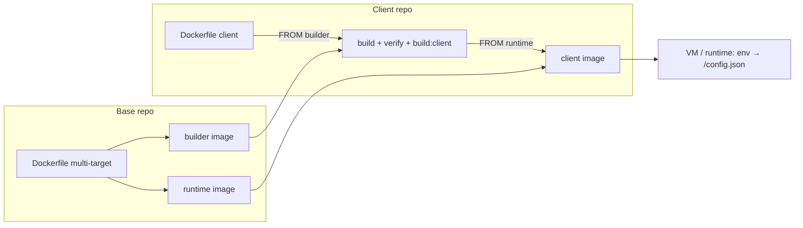
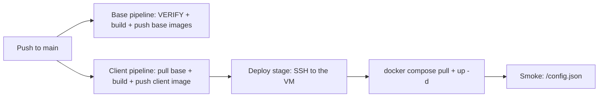

# Deployment Guide — DevOps Engineer

This guide is for **DevOps / platform engineers**: building the base and client images, pushing them to a registry, running them on servers, and keeping them healthy. Every command is designed to be copy-pasted; terms are explained as they appear. The deployment model concept lives in `ARCHITECTURE §8`, the hard rules in `CONTRACT`, and the development workflow in `DEVELOPER-GUIDE`. The Indonesian twin of this document is `DEPLOYMENT-GUIDE.md`.

Conventions: `<...>` is a placeholder to replace; commands are written for bash/zsh, and image references use the `docker.io` prefix (the default registry).

### Tutorial map

| Part | Target | Contents | Registry |
| --- | --- | --- | --- |
| **Tutorial A** — Deploy on a Laptop (Local) | developer laptop | build base + client images locally, run, smoke test, cleanup | no push/pull |
| **Tutorial B** — Deploy on an Ubuntu Server | one Ubuntu VM | Docker Engine + Compose, reverse proxy + TLS, update & rollback | pull from registry |
| **Tutorial C** — Deploy via Azure CI/CD | Azure Pipelines + VM | build/push pipeline, SSH deploy, approval | push + pull |
| **Operations & Reference** | — | environments/promotion, rollback, security, env reference, troubleshooting, cheat sheet | — |

### Prerequisites

| Need | Version | Notes |
| --- | --- | --- |
| Docker Engine | 20+ | multi-stage/multi-target builds; BuildKit not required |
| Docker Compose plugin | v2 (`docker compose`) | Tutorials B–C; Tutorial A does not use Compose |
| Git | 2.x | the default `SHA`/`BUILD_ID` comes from `git rev-parse --short HEAD` |
| Node.js + npm | 22.x + 10+ | for `VERIFY=1` and script version resolution (`node -p`, unless `BASE_VERSION`/`CLIENT_NAME` are passed); Docker uses `node:22-alpine` internally |
| Docker Hub account | — | Tutorials B–C (push/pull); Tutorial A runs fully local without login |
| Reverse proxy + TLS | nginx/Traefik/ALB | set up on the host; the container only serves HTTP:80 |

### Artifacts built

| Artifact | Contents | Tags | Image reference |
| --- | --- | --- | --- |
| Base builder | `node:22-alpine` + base source + `node_modules` + `/app/BASE_VERSION` | `<version>-builder`, `<sha>-builder` | `<registry>/<org>/arsi-web-base` |
| Base runtime | `nginx:1.27-alpine` + base dist (client `base`) + `entrypoint.sh` + `nginx.conf` | `<version>`, `<sha>` | same |
| Client image | base runtime + client dist, `ENV VITE_CLIENT=<client>` | `<buildId>` | `<registry>/<org>/arsi-web-<client>` |

- `<version>` = `web-container/package.json:version` (currently `0.1.0`); `<sha>` = short git SHA at build time; `<buildId>` = free-form build id (CI build ID / short SHA; Tutorial A uses `local`).
- `/config.json` is **not** in the image — `entrypoint.sh` generates it at container start (§1.3).

---

## 1. Concepts & Artifacts

The deployment model follows the two repo types (`ARCHITECTURE §2`): the platform team builds the **base image** once per version, then each client builds a **client image** `FROM` that base image. The client repo does **not** check out the base repo — base sources come from the builder image. In-depth explanation: `ARCHITECTURE §8`.

Four principles shape how operations work:

- **Build the base once, many extensions** — one base build produces two images (builder + runtime); each extension builds its own client image without rebuilding `web-container`/`web-modules`.
- **One image, many environments** — staging and production use the same client image; the only difference is env at start.
- **Config is not part of the image** — `entrypoint.sh` (shipped in the base runtime) writes `/config.json` from env; changing the API base/modules only needs a container recreate, no rebuild.
- **No secrets in the image** — the image contains public assets and public config only; secrets (registry tokens, TLS) live outside the image.

### 1.1 Tags

| Object | Tags | Source |
| --- | --- | --- |
| Base | `<version>`, `<version>-builder` | `web-container/package.json:version` |
| Base (immutable) | `<sha>`, `<sha>-builder` | `git rev-parse --short HEAD` |
| Client | `<buildId>` | `BUILD_ID` argument (CI build ID / short SHA) |

Promotion = **retag/pull the same image**, never rebuild; rollback = deploy the previous tag. Avoid the `latest` tag in production.

### 1.2 Pinning `baseVersion`

`manifest.json:baseVersion` in the client repo pins the exact base tag in use. During a client build, `check:base` compares the manifest value with `/app/BASE_VERSION` in the builder image; a mismatch stops the build with:

```text
[check:base] baseVersion manifest (x) != base image (y)
```

Adopting a new base = a PR that bumps `baseVersion`, then the client image is rebuilt against the new base tag. Other clients are unaffected until they bump their own `baseVersion`.

### 1.3 Runtime config

`entrypoint.sh` reads the following envs at container start, then writes them to `/config.json`:

| Env | Default | Purpose |
| --- | --- | --- |
| `VITE_CLIENT` | `base` | the `client` value in `/config.json`; the client image sets `ENV VITE_CLIENT=<client>` |
| `VITE_MODULES` | `user-management` | CSV of modules **initialized** at runtime, e.g. `user-management,product-management,module-sample` |
| `VITE_API_BASE` | `https://dummyjson.com` | API base URL for `deps.api` and module services |
| `VITE_ENABLE_AUDIT_LIVE` | `true` | feature flag (`featureFlags.enableAuditLive`) |
| `VITE_CONFIG_JSON` | — | full `/config.json` override (JSON object); when set, the individual envs are ignored |

- The file location can be overridden with `CONFIG_FILE` (default `/usr/share/nginx/html/config.json`).
- `VITE_CONFIG_JSON` wins outright and its value **must** be a JSON object (starts `{`, ends `}`); otherwise the container fails to start with `[entrypoint] VITE_CONFIG_JSON must be a JSON object`.
- Every module under `web-modules/modules/` is always bundled; `VITE_MODULES` only selects which ones are active. A module name must match its folder name — otherwise the app fails to boot with ``[bootstrap] module "x" is declared in config.modules but is not wired in moduleLoaders.generated.ts (run `npm run gen:modules`)``.
- nginx serves `/config.json` with `Cache-Control: no-store`, serves `/assets/` as immutable for 1 year, and provides the SPA fallback via `try_files $uri $uri/ /index.html`.
- The app fetches `/config.json` with `cache: 'no-store'`; the cache-header check is in A.4.

### 1.4 Deploy flow



The diagram structure matches `ARCHITECTURE §8`. The runtime target at the end is: a laptop (Tutorial A), an Ubuntu server (Tutorial B), or a VM deployed by the Azure pipeline (Tutorial C).

---

## Tutorial A — Deploy on a Laptop (Local)

**Goal:** build the base and client images on a laptop, run them at `localhost:8080`, and verify `/config.json` — without pushing to a registry. This is the fastest path to test build/deploy changes before touching a server.

Run it from the workspace root (the folder containing `ci/build-base.sh` and `web-extension-client-a/`). Docker must be running; Node 22 + npm are needed for `VERIFY=1` and the scripts' version resolution (`node -p`). Quick check:

```bash
docker version --format '{{.Server.Version}}'   # Docker Engine is running
node -v                                         # v22.x (for VERIFY=1)
git rev-parse --short HEAD                      # candidate <sha> tag
```

### A.1 Build the base image

```bash
ORG=<org> VERIFY=1 PUSH=0 ./ci/build-base.sh
```

What happens:

- `VERIFY=1` runs the full verification before building: `web-modules` (ci, typecheck, test, lint), `web-extension-default` (ci, typecheck, lint), then `web-container` (link `current-client` → default extension, ci, typecheck, test, `test:entrypoint`, `check:dockerfile`, `check:base`, build the base). `VERIFY=0` skips all of it.
- Two targets are built: `builder` (tags `<version>-builder` + `<sha>-builder`) then `runtime` (tags `<version>` + `<sha>`).
- `PUSH=0` — nothing is sent to a registry.
- `<version>` comes from `web-container/package.json:version` (currently `0.1.0`); `<sha>` from `git rev-parse --short HEAD`.

Expected output:

```text
[build-base] version=0.1.0 sha=<sha> image=docker.io/<org>/arsi-web-base
```

Verify the local tags:

```bash
docker images 'docker.io/<org>/arsi-web-base'
```

Four tags must appear: `0.1.0`, `0.1.0-builder`, `<sha>`, `<sha>-builder`. The first build is slow (downloads the base image + `npm ci` inside the build); later builds reuse cached layers.

### A.2 Build the client image

```bash
cd web-extension-client-a
ORG=<org> PULL=0 PUSH=0 BUILD_ID=local ./ci/build-client.sh
```

- `PULL=0` is mandatory in this tutorial: the base was never pushed, so do not try to pull from a registry — use the local base image from A.1.
- `BUILD_ID=local` names the image `docker.io/<org>/arsi-web-client-a:local`.
- `BASE_VERSION` and `CLIENT_NAME` come from `manifest.json` (`0.1.0` and `client-a`). `check:base` verifies `baseVersion` against `/app/BASE_VERSION` inside the builder image — a version mismatch fails the build.
- The extension verification (`typecheck`, `test --if-present`, `lint`) runs **inside the builder image**, then `CLIENT=client-a npm run build:client`.

Expected output:

```text
[build-client] client=client-a base=0.1.0 image=docker.io/<org>/arsi-web-client-a:local
```

### A.3 Run the container

```bash
docker run -d --name arsi-local -p 8080:80 \
  -e VITE_CLIENT=client-a \
  -e VITE_MODULES=user-management,product-management,module-sample \
  -e VITE_API_BASE=https://dummyjson.com \
  docker.io/<org>/arsi-web-client-a:local
```

`entrypoint.sh` (shipped in the base runtime) writes `/config.json` from the envs above at container start. Changing env = remove the container and run it again; no image rebuild needed.

The base runtime can also run standalone (default extension, client `base`) for a quick smoke test:

```bash
docker run -d --name arsi-base -p 8081:80 docker.io/<org>/arsi-web-base:0.1.0
```

### A.4 Smoke test

```bash
# 1. Config matches the env
curl -sf localhost:8080/config.json | jq -e '.client and .modules and .apiBase'

# 2. Main page returns 200
curl -s -o /dev/null -w "%{http_code}\n" localhost:8080/

# 3. SPA deep-link fallback (must be 200 + index.html, not 404)
curl -s localhost:8080/products/1 | grep -q '<div id="root">'

# 4. Config cache header
curl -sI localhost:8080/config.json | grep -i 'cache-control: no-store'

# 5. Entrypoint log
docker logs arsi-local 2>&1 | grep 'Generated'
```

Expected results:

- `/config.json` contains `"client":"client-a"`, `"modules":["user-management","product-management","module-sample"]`, and `"apiBase":"https://dummyjson.com"`.
- `/` responds `200`; `/products/1` returns `index.html` through the `try_files $uri $uri/ /index.html` fallback.
- The log contains `Generated /usr/share/nginx/html/config.json for client client-a`.
- `/config.json` is served with `Cache-Control: no-store` (browsers do not cache the config).

### A.5 Cleanup

```bash
docker rm -f arsi-local
docker rmi docker.io/<org>/arsi-web-client-a:local
docker rmi docker.io/<org>/arsi-web-base:0.1.0 docker.io/<org>/arsi-web-base:0.1.0-builder
```

The `<sha>` and `<sha>-builder` tags still point to the same base image; remove them too when no longer needed:

```bash
docker rmi docker.io/<org>/arsi-web-base:<sha> docker.io/<org>/arsi-web-base:<sha>-builder
```

Replace `<sha>` with the value from the A.1 output (defaults to `git rev-parse --short HEAD` at build time). Build cache can be cleared with `docker builder prune`.

### A.6 Failed halfway?

| Symptom | Cause & fix |
| --- | --- |
| `pull access denied` / `not found` during the client build | `PULL` defaults to `1`. Run with `PULL=0` (Tutorial A) or log in and push the base first (Tutorials B–C). |
| `[check:base] baseVersion manifest (0.1.0) != base image (x)` | The local base is not the version pinned by the manifest. Rebuild the base in A.1 with the same version, or align `BASE_VERSION`. |
| `Cannot connect to the Docker daemon` | Docker Engine is not running — check `docker version`, start Docker Desktop / `systemctl start docker`. |
| Port 8080 is already in use | Change `-p 8080:80` to `-p 8081:80` and adjust the smoke-test URLs. |
| `node: command not found` during a build | The scripts call `node -p` unconditionally to read versions, before the `VERIFY` block. Install Node 22, or pass `BASE_VERSION` explicitly (and `CLIENT_NAME` for `build-client.sh`). |
| `jq: command not found` | Install `jq` (`brew install jq`, `apt install jq`), or replace it with `grep '"client"'`. |
| `/config.json` still has the old config | The container was not recreated — `docker rm -f arsi-local` then re-run the A.3 command. |
| Image will not run on a server (`exec format error`) | The image architecture follows the build laptop (e.g. `linux/arm64` on Apple Silicon); CI/production is usually `linux/amd64`. Build via CI or set the matching `--platform`. |

### ✅ Tutorial A checklist

- [ ] Four local base tags appear: `<version>`, `<version>-builder`, `<sha>`, `<sha>-builder`.
- [ ] The client image `docker.io/<org>/arsi-web-client-a:local` is built.
- [ ] `curl -sf localhost:8080/config.json | jq -e '.client'` returns `"client-a"`.
- [ ] `/` responds 200 and the `/products/1` deep link returns `index.html`, not 404.
- [ ] `docker logs arsi-local` contains a `Generated ...` line.
- [ ] Cleanup A.5 is done.

Continue to Tutorial B (Ubuntu server) for a real deployment, then Tutorial C (Azure CI/CD) to automate build & deploy.

---

## Tutorial B — Deploy on an Ubuntu Server

**Goal:** run a client image that already exists in the registry on a single Ubuntu VM, serve HTTPS through an nginx reverse proxy + Let's Encrypt, and master updates & rollback. End state: the container serves HTTP only on `127.0.0.1:8080`, host nginx terminates TLS on 443, and `ufw` only opens 22/80/443.

Prerequisites: SSH + `sudo` access to an Ubuntu 22.04/24.04 LTS VM, and the client image already pushed to the registry. If not, push from the laptop after `docker login docker.io -u <dockerhub-user>`:

```bash
ORG=<org> VERIFY=1 PUSH=1 ./ci/build-base.sh                    # base; must exist before the client
cd web-extension-client-a
ORG=<org> PULL=1 PUSH=1 BUILD_ID=<buildId> ./ci/build-client.sh  # client image
```

For full automation, continue to Tutorial C; this tutorial waits for the image to be available in the registry. Example conventions: client `client-a`, domain `app.example.com`, tag `2026.10.10-2`. All commands run as the `deploy` user unless prefixed with `sudo`.

Principles that hold throughout the tutorial:

- **One image per VM is the production default** — strong isolation and simple rollback; multi-client is possible (B.11) but shares the Docker daemon.
- **The image is immutable & environment-agnostic** — the same tag runs in staging and production; only the `VITE_*` envs differ at start.
- **TLS on the host, container only HTTP:80** — publish to `127.0.0.1` so the container is never directly reachable from the internet.
- **No secrets in the image or `VITE_*`** — every value ends up in the public `/config.json`.

### B.1 VM Requirements

| Item | Minimum | Recommended |
| --- | --- | --- |
| OS | Ubuntu 22.04/24.04 LTS | Ubuntu 24.04 LTS |
| CPU | 1 vCPU | 2 vCPU |
| RAM | 1 GB | 2 GB |
| Disk | 10 GB | 20 GB SSD |
| Docker Engine | 24+ with Compose v2 (`docker compose`) | latest stable |
| Public IP + DNS | — | A record `app.example.com` → VM IP |
| Open ports | 22, 80, 443 | 22 restricted to office/VPN if possible |

What you need from the build pipeline before deploying:

| Value | Example | Source |
| --- | --- | --- |
| Image repository | `docker.io/<org>/arsi-web-client-a` | `build-client.sh` output |
| Immutable tag | `2026.10.10-2` / short SHA | CI `BUILD_ID` |
| Client name | `client-a` | `manifest.json:client` |
| Active modules | `user-management,product-management,module-sample` | product decision; must be bundled in the image |
| API base URL | `https://api.example.com` | backend environment |

### B.2 Preparation & hardening

```bash
# 1. Update the OS
sudo apt-get update && sudo apt-get upgrade -y

# 2. Base packages
sudo apt-get install -y ca-certificates curl gnupg jq ufw

# 3. Timezone and time sync (logs and TLS validity)
sudo timedatectl set-timezone Asia/Jakarta
sudo timedatectl set-ntp true

# 4. Create a deploy user (skip if you already have one)
sudo adduser --disabled-password --gecos "" deploy
sudo mkdir -p /home/deploy/.ssh && sudo chmod 700 /home/deploy/.ssh
# paste the public key from your workstation:
echo "ssh-ed25519 AAAA... you@workstation" | sudo tee /home/deploy/.ssh/authorized_keys
sudo chmod 600 /home/deploy/.ssh/authorized_keys
sudo chown -R deploy:deploy /home/deploy/.ssh
sudo usermod -aG sudo deploy
```

SSH hardening — **only after key login is proven to work** (`ssh deploy@<vm-ip>`):

```bash
# /etc/ssh/sshd_config.d/99-hardening.conf
PasswordAuthentication no
PermitRootLogin no
```

```bash
sudo systemctl restart ssh
```

⚠️ Do not close the old SSH session before the new key-based session is verified — a mistake here can lock you out of the VM. If the VM has a cloud console, that is your recovery path.

### B.3 Install Docker Engine + Compose plugin

Official Docker repository (on Debian replace `ubuntu` with `debian`):

```bash
sudo install -m 0755 -d /etc/apt/keyrings
curl -fsSL https://download.docker.com/linux/ubuntu/gpg \
  | sudo gpg --dearmor -o /etc/apt/keyrings/docker.gpg
sudo chmod a+r /etc/apt/keyrings/docker.gpg

echo "deb [arch=$(dpkg --print-architecture) signed-by=/etc/apt/keyrings/docker.gpg] \
https://download.docker.com/linux/ubuntu $(. /etc/os-release && echo "$VERSION_CODENAME") stable" \
  | sudo tee /etc/apt/sources.list.d/docker.list > /dev/null

sudo apt-get update
sudo apt-get install -y docker-ce docker-ce-cli containerd.io \
  docker-buildx-plugin docker-compose-plugin

sudo systemctl enable --now docker
sudo usermod -aG docker deploy      # log out/in (or `newgrp docker`) for the group to apply

docker version
docker compose version
```

Notes:

- The `docker` group is effectively root on the host. On a single-purpose VM this is the standard trade-off; for stricter isolation use rootless Docker (out of scope).
- Verify the daemon starts at boot: `systemctl is-enabled docker`.

### B.4 Registry access (Docker Hub)

Client images may be private. Create a **read-only Docker Hub token** (Account Settings → Personal access tokens, or an organization deploy token), then log in once on the VM:

```bash
# interactive
docker login docker.io -u <dockerhub-user>

# or non-interactive (token from a secret manager)
echo "<read-only-token>" | docker login docker.io -u <dockerhub-user> --password-stdin
```

Credentials are stored in `~/.docker/config.json` for the user that runs `docker compose` (here: `deploy`). If you run compose via `sudo`, credentials must exist for `root` instead — avoid mixing.

Rules:

- Use a **read-only** token on VMs. Never store a push-capable token on a production VM.
- The VM only pulls the **client image**. The base `-builder` image is a CI-only artifact and is never needed at runtime.
- Rotate the token periodically; after rotation re-run `docker login` and `docker compose pull`.

### B.5 Directory layout

One directory per client, owned by the `deploy` user:

```text
/opt/arsi-web/<client>/
├── compose.yaml            # service definition (image tag from .env)
├── .env                    # environment values (chmod 600)
└── nginx/
    └── arsi-<client>.conf  # host reverse proxy site (B.8)
```

```bash
sudo mkdir -p /opt/arsi-web/<client>/nginx
sudo chown -R deploy:deploy /opt/arsi-web/<client>
cd /opt/arsi-web/<client>
```

`chmod 600 .env`: even though the `VITE_*` values are public, the file also holds the image tag and may hold other operational values — keep it private by default.

### B.6 `compose.yaml` + `.env`

`.env` (example `client-a`):

```dotenv
BUILD_ID=2026.10.10-2
VITE_CLIENT=client-a
VITE_MODULES=user-management,product-management,module-sample
VITE_API_BASE=https://api.example.com
VITE_ENABLE_AUDIT_LIVE=false
```

- `BUILD_ID` = immutable tag from CI. Compose uses `${BUILD_ID:?...}` so `up` fails fast if it is missing.
- `VITE_CLIENT` = client identity in `/config.json`; the client image already bakes its value, but compose passes the `.env` value — do not remove it from `.env`, or the entrypoint falls back to the default `base`.
- `VITE_MODULES` must list module names that are **bundled in the image** (folder names under `web-modules/modules/`); a wrong name makes the app fail to boot (B.12).
- `VITE_ENABLE_AUDIT_LIVE` is optional; compose uses `false` when empty (production-safe), while the entrypoint fallback is `true`.

For full config from CI (beyond the four envs above), replace the `.env` contents with a single JSON value:

```dotenv
BUILD_ID=2026.10.10-2
VITE_CONFIG_JSON={"client":"client-a","modules":["user-management","product-management"],"apiBase":"https://api.example.com","featureFlags":{"enableAuditLive":false}}
```

`compose.yaml`:

```yaml
name: arsi-<client>

services:
  web:
    image: docker.io/<org>/arsi-web-<client>:${BUILD_ID:?set BUILD_ID in .env}
    container_name: arsi-web-<client>
    ports:
      - "127.0.0.1:8080:80"          # never expose port 80 directly to the internet
    environment:
      VITE_CLIENT: ${VITE_CLIENT}
      VITE_MODULES: ${VITE_MODULES:?set VITE_MODULES in .env}
      VITE_API_BASE: ${VITE_API_BASE:?set VITE_API_BASE in .env}
      VITE_ENABLE_AUDIT_LIVE: ${VITE_ENABLE_AUDIT_LIVE:-false}
    restart: unless-stopped
    healthcheck:
      test: ["CMD", "wget", "-qO-", "http://127.0.0.1/"]
      interval: 30s
      timeout: 5s
      retries: 3
      start_period: 10s
    logging:
      driver: json-file
      options:
        max-size: "10m"
        max-file: "3"
    security_opt:
      - no-new-privileges:true
```

Full-override variant (CI-driven config) — replace the `environment:` block with:

```yaml
    environment:
      VITE_CONFIG_JSON: |
        {"client":"client-a","modules":["user-management","product-management"],"apiBase":"https://api.example.com","featureFlags":{"enableAuditLive":false}}
```

Why these choices:

- `127.0.0.1:8080:80` — Docker publishes ports bypassing `ufw`; binding to loopback makes the host proxy the only public entry point (B.8).
- `restart: unless-stopped` — the container comes back automatically after a VM reboot (the Docker daemon restarts it).
- `healthcheck` — uses the busybox `wget` shipped in `nginx:alpine`; its status shows in `docker compose ps`.
- `logging` — caps `json-file` logs so they cannot fill the disk.
- `security_opt` — `no-new-privileges` is cheap; the nginx master still runs as root inside the container (image behavior).

Changing config only needs a container recreate, not an image rebuild: `docker compose up -d --force-recreate`. The full env reference is in the Operations & Reference part.

### B.7 First deploy

```bash
cd /opt/arsi-web/<client>

# 1. Create the deploy files (contents from B.6)
nano compose.yaml
nano .env && chmod 600 .env

# 2. Log in if the image is private (B.4)
docker login docker.io -u <dockerhub-user>

# 3. Pull and start
docker compose pull
docker compose up -d

# 4. Status and health
docker compose ps                       # State: running, Health: healthy

# 5. Config check (client + modules + apiBase must match .env)
curl -s http://127.0.0.1:8080/config.json | jq .

# 6. Entrypoint log
docker logs arsi-web-<client> 2>&1 | grep Generated
```

Expected `/config.json`:

```json
{
  "client": "client-a",
  "modules": ["user-management", "product-management", "module-sample"],
  "apiBase": "https://api.example.com",
  "featureFlags": {
    "enableAuditLive": false
  }
}
```

⚠️ `Health: starting` during `start_period` (10 seconds) is normal; wait until `healthy`. Expected log line: `Generated /usr/share/nginx/html/config.json for client client-a`. If DNS/TLS is not ready yet, verify through this loopback URL first, then continue to B.8.

### B.8 Reverse proxy + TLS (nginx + Certbot)

DNS must already point to the VM before Certbot (table at the end of this subsection). Install and create the site:

```bash
sudo apt-get install -y nginx certbot python3-certbot-nginx
```

`/opt/arsi-web/<client>/nginx/arsi-<client>.conf`:

```nginx
server {
    listen 80;
    server_name app.example.com;

    # Security headers (certbot does NOT add HSTS; add it manually after TLS works)
    add_header X-Content-Type-Options nosniff always;
    add_header X-Frame-Options SAMEORIGIN always;
    add_header Referrer-Policy strict-origin-when-cross-origin always;

    location / {
        proxy_pass http://127.0.0.1:8080;
        proxy_http_version 1.1;
        proxy_set_header Host $host;
        proxy_set_header X-Real-IP $remote_addr;
        proxy_set_header X-Forwarded-For $proxy_add_x_forwarded_for;
        proxy_set_header X-Forwarded-Proto $scheme;
        proxy_read_timeout 60s;
    }
}
```

```bash
sudo ln -sf /opt/arsi-web/<client>/nginx/arsi-<client>.conf \
  /etc/nginx/sites-enabled/arsi-<client>.conf
sudo rm -f /etc/nginx/sites-enabled/default
sudo nginx -t && sudo systemctl reload nginx

# DNS must already point app.example.com → this VM, and port 80 must be reachable
sudo certbot --nginx -d app.example.com --redirect --agree-tos -m ops@example.com
```

Certbot installs a systemd timer that renews certificates automatically. Verify:

```bash
systemctl list-timers | grep certbot
curl -sI https://app.example.com/ | head -1
```

Notes:

- The SPA deep links are already resolved by the container via `try_files $uri $uri/ /index.html`; the host proxy just forwards `location /` as-is and needs no rewrite.
- Cache headers pass through unchanged: `/config.json` `no-store`, `/assets/` `public, immutable`. Do not add conflicting cache rules on the host.
- Add HSTS (`Strict-Transport-Security`) only after HTTPS is proven stable, so old clients are not locked out.

Caddy alternative (automatic HTTPS):

```bash
sudo apt-get install -y debian-keyring debian-archive-keyring apt-transport-https curl
curl -1sLf 'https://dl.cloudsmith.io/public/caddy/stable/gpg.key' \
  | sudo gpg --dearmor -o /usr/share/keyrings/caddy-stable-archive-keyring.gpg
curl -1sLf 'https://dl.cloudsmith.io/public/caddy/stable/debian.deb.txt' \
  | sudo tee /etc/apt/sources.list.d/caddy-stable.list
sudo apt-get update && sudo apt-get install -y caddy
```

`/etc/caddy/Caddyfile`:

```caddyfile
app.example.com {
    encode zstd gzip
    reverse_proxy 127.0.0.1:8080
}
```

```bash
sudo caddy validate --config /etc/caddy/Caddyfile
sudo systemctl reload caddy
```

DNS:

| Record | Value |
| --- | --- |
| `A` | `app.example.com` → VM public IP |
| `AAAA` | optional, only if the VM has IPv6 |

Without a domain, you can deploy behind an internal load balancer or use a self-signed certificate for testing (browsers will warn).

### B.9 Firewall

```bash
sudo ufw allow OpenSSH
sudo ufw allow 80/tcp
sudo ufw allow 443/tcp
sudo ufw enable
sudo ufw status verbose
```

Two important details:

1. **Docker publishes ports below `ufw`.** Binding the container to `127.0.0.1` (B.6) is what actually prevents direct public access. Never publish `0.0.0.0:8080`.
2. Restrict SSH to known networks when possible: `sudo ufw allow from <office-cidr> to any port 22 proto tcp`.

### B.10 Update & rollback

Deploy a new tag (from CI output):

```bash
cd /opt/arsi-web/<client>

# 1. Set the new immutable tag
sed -i 's/^BUILD_ID=.*/BUILD_ID=2026.10.10-2/' .env

# 2. Pull and recreate
docker compose pull
docker compose up -d

# 3. Verify
docker compose ps
curl -sf http://127.0.0.1:8080/config.json | jq -e '.client and .modules and .apiBase'
docker logs arsi-web-<client> 2>&1 | grep Generated
```

A single replica is recreated in place, so expect a **brief blip** (seconds) while nginx restarts. If strict zero downtime is required, run two containers behind the proxy and switch upstreams after the new one is `healthy` (keep the old container until the switch).

Configuration-only change (no new image):

```bash
nano .env                        # VITE_MODULES / VITE_API_BASE / VITE_CONFIG_JSON
docker compose up -d --force-recreate
```

Rollback = deploy the previous tag:

```bash
sed -i 's/^BUILD_ID=.*/BUILD_ID=<previous-build-id>/' .env
docker compose pull
docker compose up -d
docker compose ps
```

Always record the last known-good tag per release. Do not reuse or retag old versions to new numbers — deploy the original immutable tag.

Optional `deploy.sh` (pull + up + verify + automatic rollback):

```bash
#!/usr/bin/env bash
set -euo pipefail

cd "$(dirname "$0")"
NEW_TAG="${1:?usage: ./deploy.sh <image-tag>}"
PREVIOUS_TAG="$(grep -E '^BUILD_ID=' .env | cut -d= -f2)"
echo "[deploy] current=${PREVIOUS_TAG} new=${NEW_TAG}"

sed -i "s/^BUILD_ID=.*/BUILD_ID=${NEW_TAG}/" .env
docker compose pull
docker compose up -d

for _ in $(seq 1 30); do
  if curl -sf http://127.0.0.1:8080/config.json >/dev/null; then
    echo "[deploy] OK — ${NEW_TAG} is serving"
    echo "[deploy] rollback: sed -i 's/^BUILD_ID=.*/BUILD_ID=${PREVIOUS_TAG}/' .env && docker compose up -d"
    exit 0
  fi
  sleep 2
done

echo "[deploy] FAILED — rolling back to ${PREVIOUS_TAG}" >&2
sed -i "s/^BUILD_ID=.*/BUILD_ID=${PREVIOUS_TAG}/" .env
docker compose up -d
exit 1
```

```bash
chmod +x deploy.sh
./deploy.sh 2026.10.10-2
```

### B.11 Multiple clients on one VM

Recommended only for non-production or low-risk clients. The production default remains one client per VM.

Rules when sharing a VM:

- One directory and one Compose project per client (`/opt/arsi-web/<client>`), each with a unique `name:` in `compose.yaml`.
- Unique host port per client: `127.0.0.1:8081:80`, `127.0.0.1:8082:80`, …
- Unique hostname per client: `app-a.example.com`, `app-b.example.com` → separate proxy server blocks (B.8).
- Budget ~50–100 MB RAM per idle nginx container plus OS/proxy overhead.

```text
/opt/arsi-web/
├── client-a/   compose.yaml (name: arsi-client-a, 127.0.0.1:8081:80)
├── client-b/   compose.yaml (name: arsi-client-b, 127.0.0.1:8082:80)
└── client-c/   compose.yaml (name: arsi-client-c, 127.0.0.1:8083:80)
```

All clients share the Docker daemon and host kernel — a crash or resource exhaustion in one image can affect the others. Use per-service memory limits if needed:

```yaml
    deploy:
      resources:
        limits:
          memory: 256M
```

### B.12 Operations: logs, health, disk

**Logs:**

```bash
cd /opt/arsi-web/<client>
docker compose logs -f --tail=100          # follow app logs
docker logs arsi-web-<client> 2>&1 | grep Generated
journalctl -u nginx -f                     # nginx proxy
journalctl -u caddy -f                     # when using Caddy
```

The compose `logging` block caps `json-file` logs at 3 × 10 MB per container. For centralized logging, add a log shipper or switch the driver (out of scope).

**Health:**

```bash
docker compose ps
docker inspect --format '{{.State.Health.Status}}' arsi-web-<client>
curl -sf http://127.0.0.1:8080/config.json >/dev/null && echo OK
```

Add an external uptime check against `https://app.example.com/config.json` (expects HTTP 200 with valid JSON) and alert on two consecutive failures.

**Disk:**

```bash
df -h /
docker system df
docker image prune -a --filter "until=168h"   # remove unused images older than 7 days
```

`docker image prune -a` removes every image not used by a running container — the deployed image is in use, so it is safe. Run it from cron if disk pressure is a concern.

**Reboot behavior:** `restart: unless-stopped` + `systemctl enable docker` is enough; after a VM reboot the container starts automatically. If you want `systemctl` as the single control surface, wrap the Compose project in a systemd unit:

```ini
# /etc/systemd/system/arsi-<client>.service
[Unit]
Description=ARSI web <client> (docker compose)
Requires=docker.service
After=docker.service network-online.target
Wants=network-online.target

[Service]
Type=oneshot
RemainAfterExit=yes
WorkingDirectory=/opt/arsi-web/<client>
ExecStart=/usr/bin/docker compose up -d --remove-orphans
ExecStop=/usr/bin/docker compose down
TimeoutStartSec=0
User=deploy
Group=deploy

[Install]
WantedBy=multi-user.target
```

```bash
sudo systemctl daemon-reload
sudo systemctl enable --now arsi-<client>
sudo systemctl status arsi-<client>
```

**VM troubleshooting:**

| Symptom | Cause & fix |
| --- | --- |
| `docker compose pull` → `unauthorized` / `pull access denied` | Private image and no/expired login. `docker login docker.io` with a read-only token as the same user running compose (B.4). |
| `502 Bad Gateway` from the proxy | Container down or wrong port. `docker compose ps`, `curl -s http://127.0.0.1:8080/`; check the `ports` mapping. |
| Site reachable on the VM but not from the internet | DNS not pointing to the VM, or `ufw` missing 80/443. `dig app.example.com`, `sudo ufw status`. |
| `bind: address already in use` on `up` | Host port conflict. `ss -ltnp \| grep 8080`, choose another port, update the proxy upstream. |
| App boots but shows ``[bootstrap] module "x" is declared in config.modules but is not wired in moduleLoaders.generated.ts (run `npm run gen:modules`)`` | `VITE_MODULES` includes a name that is not bundled in the image. Fix `.env` or rebuild the base with that module. |
| Config changes not visible | Container not recreated, or browser cache. `docker compose up -d --force-recreate`, hard-refresh; `/config.json` is `no-store`. |
| Container exits with `[entrypoint] VITE_CONFIG_JSON must be a JSON object` | The `VITE_CONFIG_JSON` value is not a JSON object (truncated, array, misquoted). Fix it, or unset it to use the individual `VITE_*` envs. |
| App boots with no modules after a full override | The JSON is valid but `modules` is empty/missing. Add the bundled module names; verify with `curl /config.json`. |
| API calls fail with CORS errors | The `VITE_API_BASE` origin differs from the app origin and the backend does not allow it. Fix CORS or serve the API under the same domain. |
| Certbot fails validation | DNS not propagated, port 80 blocked, or another server block answers for the domain. Fix DNS/`ufw`, then re-run `certbot --nginx`. |
| HTTPS works but old HTTP bookmarks break | Enable the redirect (`certbot --nginx --redirect`) or add `return 301 https://$host$request_uri;`. |
| Container restarts in a loop | Check `docker logs arsi-web-<client>`; usually a bad `.env` value or an image that is not the expected client. |
| App down after VM reboot | Docker daemon not enabled or the `restart` policy missing. `systemctl is-enabled docker`, verify `restart: unless-stopped`. |
| Disk full | Unbounded logs/images. Check `docker system df`, verify compose log limits, prune old images (B.12). |
| `curl /config.json` returns HTML | The proxy is routing `/config.json` to a catch-all or SPA. Check `server_name`/`proxy_pass` and remove default sites. |

### ✅ Tutorial B go-live checklist

- [ ] `docker compose ps` → `running` + `healthy`.
- [ ] `https://app.example.com/config.json` → `client`/`modules`/`apiBase` correct and `Cache-Control: no-store`.
- [ ] Login and every module in `VITE_MODULES` renders; deep links do not 404.
- [ ] API calls succeed (no CORS/4xx/5xx in the browser console).
- [ ] TLS valid + auto-renew (`systemctl list-timers | grep certbot`).
- [ ] Immutable image tag recorded + rollback tag known.
- [ ] `ufw` enabled; container only on `127.0.0.1`; `.env` `chmod 600`.
- [ ] External uptime check against `/config.json` configured.
- [ ] No secrets in `VITE_*`.

To automate build & deploy, continue to Tutorial C (Azure CI/CD).

---

## Tutorial C — Deploy via Azure CI/CD

Tutorial C connects two Azure DevOps pipelines to the VM from DEPLOYMENT-GUIDE Tutorial B. The base pipeline builds base images; the client pipeline builds the client image and deploys it over SSH. The deployed artifact is the same image as in Tutorials A/B — the pipelines only replace the manual steps (`docker build`, `docker push`, `sed .env`, `docker compose up -d`).

Prerequisite: the VM has completed Tutorial B (layout `/opt/arsi-web/client-a`, `compose.yaml`, `.env`) because the deploy stage relies on all three. Image and tag concepts are in ARCHITECTURE §8 and `CONTRACT`. All YAML files are already in the repo; this tutorial explains their contents and the Azure DevOps setup.



A push to `main` triggers each repo's pipeline. The client pipeline always pulls the base pinned in `manifest.json:baseVersion`, so it does not wait for the base pipeline — just make sure that base version exists on Docker Hub (C.8).

| Pipeline | Repo | YAML file | Output |
| --- | --- | --- | --- |
| Base | base repo | `azure-pipelines.yml` (root) | base image `<version>` + `<sha>` |
| Client | client repo | `azure-pipelines.yml` (root; in this workspace `web-extension-client-a/azure-pipelines.yml`) | client image `<buildId>` + VM deploy |

### C.1 Azure DevOps prerequisites

| Requirement | Detail |
| --- | --- |
| Organization + project | Azure DevOps Services; one project, e.g. `arsi-web` |
| Repos | base repo and client repo connected (Azure Repos Git, or GitHub) |
| Agent | **Microsoft-hosted** pool, `ubuntu-latest`; the runner already provides Docker, no self-hosted agent needed |
| Docker Hub | account + namespace/org; read/write access token for pushes |
| VM from Tutorial B | hostname (e.g. `app.example.com`), port 22 reachable from the runner, user `deploy` |
| Permissions | project admin role to create service connections and environments |

Steps:

1. Create the project and invite the team responsible for approvals.
2. Make sure both repos show up in **Repos → Files** and their default branch is `main`.
3. Make sure the Docker Hub namespace used later matches `dockerHubOrg` (C.2).

### C.2 Service connections & variable groups

Pipelines store no credentials; the YAML only references the *names* of service connections and variable groups.

**Docker Hub service connection** — Project settings → Service connections → New service connection → Docker Registry → Docker Hub:

- Name: `arsi-dockerhub-client-a` (base: `arsi-dockerhub-base`).
- Username: Docker Hub account; Password: read/write access token (Docker Hub → Account settings → Personal access tokens).
- This name is what the YAML uses as `dockerHubConnection`.

**SSH service connection** — New service connection → SSH:

- Name: `arsi-vm-client-a`.
- Host `app.example.com`, port `22`, username `deploy`, private key owned by user `deploy` (Tutorial B B.2) — paste the private key into the form, never into the repo.
- This name is what the YAML uses as `vmSshConnection`.

**Variable group** — Pipelines → Library → + Variable group. Create two:

Group `arsi-web-base`:

| Variable | Example value | Contents |
| --- | --- | --- |
| `dockerHubOrg` | `my-company` | Docker Hub namespace/org |
| `dockerHubConnection` | `arsi-dockerhub-base` | Docker service connection name |

Group `arsi-web-client-a`:

| Variable | Example value | Contents |
| --- | --- | --- |
| `dockerHubOrg` | `my-company` | Docker Hub namespace/org |
| `dockerHubConnection` | `arsi-dockerhub-client-a` | Docker service connection name |
| `vmSshConnection` | `arsi-vm-client-a` | SSH service connection name |
| `vmDeployPath` | `/opt/arsi-web/client-a` | Compose project directory on the VM (Tutorial B B.5) |

- The group name must match `- group:` in the YAML exactly; variable names must match `$(...)` in the YAML.
- Tokens/passwords are not written in YAML — they live in the service connections. If a sensitive value must be in a variable group, mark the lock icon (secret).
- After creating the pipeline, authorize the group: Library → group → Pipeline permissions (or project).

### C.3 Base pipeline

The `azure-pipelines.yml` file lives at the base repo root (in this workspace: project root).

Create the pipeline: **Pipelines → New pipeline → Azure Repos Git (base repo) → Existing Azure Pipelines YAML file → `/azure-pipelines.yml` → Run**.

The base repo `azure-pipelines.yml` (identical to the file shipped in the repo):

```yaml
# Azure Pipelines — base repo (arsi-web-base)
# Build & push base images (builder + runtime) ke Docker Hub.
# Deploy tidak di sini: image base dipakai client image (lihat DEPLOYMENT-GUIDE Tutorial C).

trigger:
  branches:
    include:
      - main
  tags:
    include:
      - 'v*'

pr: none

variables:
  - group: arsi-web-base          # dockerHubOrg, dockerHubConnection
  - name: REGISTRY
    value: docker.io

stages:
  - stage: BuildPush
    displayName: Build & push base images
    jobs:
      - job: base
        pool:
          vmImage: ubuntu-latest
        steps:
          - checkout: self
          - task: NodeTool@0
            displayName: Node 22 (VERIFY=1)
            inputs:
              versionSpec: '22.x'
          - task: Docker@2
            displayName: Login Docker Hub
            inputs:
              command: login
              containerRegistry: $(dockerHubConnection)
          - script: ORG="$(dockerHubOrg)" VERIFY=1 PUSH=1 ./ci/build-base.sh
            displayName: Build & push base (VERIFY=1 PUSH=1)
          - script: |
              set -euo pipefail
              BASE_VERSION="$(node -p "require('./web-container/package.json').version")"
              docker run -d --rm -p 8080:80 --name base-smoke "$(REGISTRY)/$(dockerHubOrg)/arsi-web-base:${BASE_VERSION}"
              sleep 3
              curl -sf http://localhost:8080/config.json | grep -q '"client"'
              docker rm -f base-smoke
            displayName: Smoke test base image
```

What each part does:

- `trigger`: pushes to `main` and tags `v*`; `pr: none` means PRs do not trigger a build — artifacts are produced on merge/tag.
- `variables`: variable group `arsi-web-base` + `REGISTRY=docker.io`.
- Stage `BuildPush`, job `base` on `ubuntu-latest`:
  1. `checkout: self` — fetch the repo source.
  2. `NodeTool@0` version `22.x` — required by `VERIFY=1` (typecheck/test/lint + `check:base`).
  3. `Docker@2` `command: login` with `containerRegistry: $(dockerHubConnection)`.
  4. `ORG="$(dockerHubOrg)" VERIFY=1 PUSH=1 ./ci/build-base.sh` — builds the builder + runtime targets, then pushes two kinds of tags for each image: `<version>-builder`/`<sha>-builder` and `<version>`/`<sha>` (four tags in total). `<version>` comes from `web-container/package.json`; `<sha>` is the commit.
  5. Runner smoke test: run the `<version>` runtime image on port 8080, wait 3 seconds, `curl /config.json` must contain `"client"`, then remove the container.

Base release: merge to `main` then create git tag `v0.1.0` → image `<version>` + `<sha>` available. Commits without a tag still produce a `<sha>` image.

### C.4 Client pipeline

The `azure-pipelines.yml` file lives at the client repo root (in this workspace: `web-extension-client-a/azure-pipelines.yml`). Other clients copy `web-extension-template/azure-pipelines.yml` and replace the `<x>`/`<client>` placeholders.

Create the pipeline: same as C.3, pointing at the client repo YAML.

- Variable `BUILD_ID: $(Build.SourceVersion)` — full commit SHA; used as the image tag **and** as the `BUILD_ID` value in the VM `.env`, so every deployment is traceable to a commit.
- Stage `BuildPush`:
  1. `checkout: self`; `Docker@2` login.
  2. `ORG="$(dockerHubOrg)" PUSH=1 BUILD_ID="$(BUILD_ID)" ./ci/build-client.sh` — pulls the base builder + runtime at the `manifest.json:baseVersion` tag, runs `check:base`, builds, then pushes a single tag `docker.io/<org>/arsi-web-client-a:<full-sha>`.
- Stage `Deploy`: `dependsOn: BuildPush` + `condition: succeeded()`; the `deployment` job targets environment `arsi-web-client-a-production` (C.5) and runs SSH to the VM (C.6).
- Tag = commit, so re-running the pipeline for the same commit pushes the same tag (identical contents) — safe to repeat.
- If `check:base` fails, the build stops with `[check:base] baseVersion manifest (x) != base image (y)` — fix `manifest.json` or release a new base (C.8).

### C.5 Environment + approval

Approvals are not written in YAML; they are configured on the Azure DevOps *environment*.

1. **Pipelines → Environments → New environment** → name `arsi-web-client-a-production` (must match `environment:` in the YAML exactly).
2. Open the environment → **Approvals and checks → Approvals** → add an approver (e.g. release manager).
3. Recommended: add **Branch control** (`main` only) so deployments cannot be triggered from other branches.
4. When a run reaches the `Deploy` stage, it pauses at *Waiting for approval*. Once the approver approves, the SSH task runs; the decision and timestamp are recorded in the environment/run history.
5. Approval timeout defaults to 30 days and is configurable; approvals left hanging too long are automatically rejected.

If the environment does not exist, Azure DevOps creates it automatically on the first run — but without approvers. Create it up front so approval can be configured.

### C.6 Deploy stage

The `deployment` job (`runOnce` strategy) runs a single `SSH@0` task on the VM:

```yaml
sshEndpoint: $(vmSshConnection)
runOptions: inline
inline: |
  set -e
  cd "$(vmDeployPath)"
  sed -i "s|^BUILD_ID=.*|BUILD_ID=$(BUILD_ID)|" .env
  docker compose pull
  docker compose up -d
  curl -sf http://localhost:8080/config.json | grep -q '"client"'
```

Line by line:

- `set -e` — stop on the first error; the step is marked failed.
- `cd "$(vmDeployPath)"` — the Compose project directory (Tutorial B B.5).
- `sed` replaces the `BUILD_ID` line in `.env`; `compose.yaml` uses image `...:${BUILD_ID}` (Tutorial B B.6).
- `docker compose pull` + `up -d` — fetch the new tag then recreate the container; expect a brief blip (Tutorial B B.10).
- `curl` smoke on the VM — the container binds to `127.0.0.1:8080`, so `localhost` over SSH works; a failure here fails the deployment.

Prerequisites that must already be correct:

- `.env` + `compose.yaml` exist in `vmDeployPath` (manual first deploy: Tutorial B B.7).
- The SSH user (`deploy`) may run Docker and has `docker login` read-only if the image is private (Tutorial B B.3–B.4).
- The Microsoft-hosted runner can reach port 22 on the VM; credentials live in the SSH service connection, not the YAML.
- Compose plugin v2 (`docker compose`, not `docker-compose`).

On failure: check the SSH task log. A failed pull → the old container keeps running; a failed smoke after `up -d` → the container is already on the new tag and must be rolled back (C.7).

### C.7 Rollback

Fastest path on the VM (same as Tutorial B B.10):

```bash
ssh deploy@app.example.com
cd /opt/arsi-web/client-a
sed -i 's/^BUILD_ID=.*/BUILD_ID=<previous-build-id>/' .env
docker compose pull
docker compose up -d
curl -sf http://localhost:8080/config.json | grep -q '"client"'
```

Via the pipeline (recorded in run history + approval): tag the release commit with a git tag (e.g. `release-2026-10-10`) and run the pipeline on that ref — **Run pipeline → Branch/tag → `release-2026-10-10`**. `BUILD_ID=$(Build.SourceVersion)` automatically becomes the old tag; `BuildPush` rebuilds from identical source and re-pushes the same tag; `Deploy` pulls it after approval.

⚠️ Do not override the `BUILD_ID` queue-time variable while `BuildPush` checks out `main`: the old tag would be overwritten with an image from newer source. If you only want to change the tag without rebuilding, use the VM steps above.

- Record the known-good tag for every release (run history / release notes).
- Rollback always points at the original immutable tag; never retag old versions (Tutorial B B.10).
- After rollback, fix `main`; the fix commit produces a new BUILD_ID and deploys normally.

### C.8 Adopting a new base

1. Base release: merge + tag `v<version>` in the base repo (C.3) → base image `<version>` on Docker Hub.
2. In the client repo, open a PR that bumps `manifest.json:baseVersion` to the new `<version>`.
3. Merge the PR to `main` → the client pipeline runs: `check:base` verifies the new builder image, then builds + pushes the new `BUILD_ID`.
4. Approve in the environment → deploy.

Example PR diff in the client repo:

```diff
 {
   "client": "client-a",
-  "baseVersion": "0.1.0",
+  "baseVersion": "0.2.0",
   "modules": {
     "user-management": "^0.1.0",
     "product-management": "^0.1.0",
     "module-sample": "^0.1.0"
   },
   "shared": "^0.1.0",
   "overrides": ["user-management", "module-sample"]
 }
```

Notes:

- Other clients are unaffected until each one bumps its own `baseVersion` (see DEPLOYMENT-GUIDE Tutorial B and §1.2).
- Ordering: release the base first, confirm its tag can be pulled, then merge the client PR.
- Rollback of the adoption: revert the `baseVersion` PR (rebuild) or deploy the previous `BUILD_ID` (C.7).

### ✅ Tutorial C checklist

- [ ] Base pipeline green on `main`/tag push; image `<version>` + `<sha>` on Docker Hub.
- [ ] Client pipeline green; image `arsi-web-client-a:<sha>` on Docker Hub.
- [ ] Environment `arsi-web-client-a-production` has an approver; approval recorded in run history.
- [ ] SSH deploy succeeds; after approval, `/config.json` on the VM is correct.
- [ ] VM `.env` contains the `BUILD_ID` of the deployed commit.
- [ ] Rollback has been exercised at least once (VM steps or a run from the old release tag).
- [ ] No tokens/passwords in YAML or non-secret variables.

---

## Environments & Promotion

The same client image runs in every environment; only the start-up env differs. Promotion = use the same tag, not a rebuild.

| Environment | Image | Config source | How to promote |
| --- | --- | --- | --- |
| Staging | `docker.io/<org>/arsi-web-<client>:<buildId>` | variable group / staging `.env` | client pipeline on `main` (Tutorial C C.4) |
| Production | **the same image** (same `<buildId>` tag) | production variable group / `.env` | environment approval, then SSH deploy (Tutorial C C.5–C.6) |

Rules:

- Keep per-environment values in a variable group (Tutorial C C.2) or a secret manager — never in the repo.
- Changing env = recreating the container, not rebuilding: `docker compose up -d --force-recreate`, then verify `/config.json` (Tutorial B B.10).
- Staging and production may use different `VITE_MODULES`/`VITE_API_BASE`; never put secrets in `VITE_*` (see Security Checklist).
- Adopting a new base = a PR that bumps `manifest.json:baseVersion` (§1.2), then release through the pipeline (Tutorial C C.8).
- Go-live checklist: see **Tutorial B — ✅ Tutorial B go-live checklist**.

## Post-Deploy Smoke Test

Run after every deploy (VM or pipeline), from the VM:

```bash
BASE=http://localhost:8080
CLIENT=arsi-web-<client>          # container name (Tutorial B B.6)

# 1. Config matches the environment
curl -sf "$BASE/config.json" | jq -e '.client and .modules and .apiBase'

# 2. Landing page returns 200
curl -sI "$BASE/" | head -1

# 3. SPA deep-link fallback (must be 200 + index.html)
curl -s "$BASE/products/1" | grep -q '<div id="root">'

# 4. Immutable asset cache header
curl -sI "$BASE/assets/$(curl -s "$BASE/" | grep -o 'assets/index-[^"]*\.js' | head -1 | cut -d/ -f2)" \
  | grep -i 'cache-control: public, immutable'

# 5. Entrypoint log
docker logs "$CLIENT" 2>&1 | grep Generated
```

Set `BASE=https://app.example.com` to verify the public path (proxy + TLS, Tutorial B B.8).

Manual checklist:

- [ ] Login succeeds and every module in `VITE_MODULES` renders.
- [ ] `client`/`modules`/`apiBase` in `/config.json` match `.env`/the variable group.
- [ ] Deep links (e.g. `/products/1`) do not 404; the SPA fallback works.
- [ ] No CORS/4xx/5xx errors in the browser console.
- [ ] `enableAuditLive` matches the environment.
- [ ] `/config.json` is not cached by the browser (hard-refresh, then check the `no-store` header).
- [ ] `docker compose ps` → `running` + `healthy`.

## Security Checklist

| Control | Rule |
| --- | --- |
| Secrets | No secrets in `VITE_*` — every value lands in the public `/config.json`. Tokens/passwords live only in service connections/secret managers (Tutorial C C.2). |
| TLS | Terminated at the host reverse proxy (Tutorial B B.8); the container serves HTTP:80 on `127.0.0.1` only (B.6/B.9); never publish `0.0.0.0:8080`. |
| Registry token | The VM uses a **read-only** token (Tutorial B B.4); push-capable tokens only in CI; rotate periodically and log in again. |
| Private base builder | The `<version>-builder` image contains source + `node_modules` — keep it private; only the extension pipeline pulls it. |
| Image scanning | Scan before promotion: `docker scout cves docker.io/<org>/arsi-web-<client>:<buildId>` (or Trivy); address HIGH/CRITICAL findings. |
| Runtime hardening | `security_opt: no-new-privileges:true` (Tutorial B B.6); SSH key-only (B.2); `ufw` allows only 22/80/443 (B.9). |
| Audit | Record the image tag + `baseVersion` + env values for every deploy; `config.json` exposes `client`, `modules`, `apiBase` — make sure none of it is sensitive. |

## Env Reference

Source: `web-container/docker/entrypoint.sh` (runs at container start). Concept summary in §1.3; example `.env`/`compose.yaml` in Tutorial B B.6.

| Env | Default | Purpose | Set in |
| --- | --- | --- | --- |
| `VITE_CLIENT` | `base` | `client` value in `/config.json` | `.env` (B.6) / variable group (C.2) |
| `VITE_MODULES` | `user-management` | CSV of modules to init; names must match folders under `web-modules/modules/` | same |
| `VITE_API_BASE` | `https://dummyjson.com` | API base URL for `deps.api` and module services | same |
| `VITE_ENABLE_AUDIT_LIVE` | `true` | `featureFlags.enableAuditLive` flag | same |
| `VITE_CONFIG_JSON` | — | full `/config.json` override (JSON object); when set, the four envs above are ignored | `.env` / variable group |
| `CONFIG_FILE` | `/usr/share/nginx/html/config.json` | output config file location | rarely changed (container test/debug) |

Notes:

- `VITE_CONFIG_JSON` always wins; it **must** be a JSON object (starts with `{`, ends with `}`) — otherwise the container fails to start with `[entrypoint] VITE_CONFIG_JSON must be a JSON object`.
- The defaults above are only entrypoint fallbacks; Tutorial B's `compose.yaml` sets `VITE_ENABLE_AUDIT_LIVE` to `false` when `.env` is empty (production-safe).
- All modules under `web-modules/modules/` are always bundled (lazy chunks); `VITE_MODULES` only selects which are active at runtime.
- Container-less dev uses the same envs via `web-container/scripts/dev-config.mjs`.

## Rollback

Matrix per scenario; rollback always points at the original immutable tag — never retag old versions.

| Scenario | Action | Verify |
| --- | --- | --- |
| VM Compose container on a bad tag | Set the previous `BUILD_ID` in `.env`, pull + up (Tutorial B B.10) | `docker compose ps`, `curl /config.json` |
| Bad pipeline deploy | Run the pipeline on the old release ref (Run pipeline → Branch/tag), or deploy the old tag over SSH (Tutorial C C.7) | green run + `/config.json` on the VM |
| Bad config (image is fine) | Fix `.env`/the variable group, then `docker compose up -d --force-recreate` (Tutorial B B.10) | `/config.json` matches the environment |
| Bad `baseVersion` adoption | Revert the `baseVersion` PR (rebuild) or deploy the previous `BUILD_ID` (Tutorial C C.7–C.8) | `check:base` passes on rebuild |

Quick commands (VM):

```bash
cd /opt/arsi-web/<client>
sed -i 's/^BUILD_ID=.*/BUILD_ID=<previous-tag>/' .env
docker compose pull
docker compose up -d
curl -sf http://localhost:8080/config.json | jq -e '.client and .modules and .apiBase'
```

- Record the known-good tag for every release (run history / release notes).
- After rollback, fix `main`; the fix commit produces a new BUILD_ID.
- Rollback does not delete the bad image from the registry — just stop using it.

## Cheat Sheet

```bash
# --- Local: build images (workspace root) ---
ORG=<org> VERIFY=1 PUSH=1 ./ci/build-base.sh                     # base (two images)
cd web-extension-client-a
ORG=<org> PULL=1 PUSH=1 BUILD_ID=$(git rev-parse --short HEAD) ./ci/build-client.sh

# --- VM: deploy / update (Tutorial B) ---
cd /opt/arsi-web/<client>
docker compose pull && docker compose up -d
docker compose ps
curl -sf http://localhost:8080/config.json | jq -e '.client and .modules and .apiBase'
docker logs arsi-web-<client> 2>&1 | grep Generated

# --- VM: change config without a new image ---
nano .env && docker compose up -d --force-recreate

# --- VM: rollback ---
sed -i 's/^BUILD_ID=.*/BUILD_ID=<previous-tag>/' .env
docker compose pull && docker compose up -d

# --- Azure Pipelines (Tutorial C) ---
# UI: Pipelines → <pipeline> → Run pipeline → Branch/tag → pick the ref
az pipelines run --name <client-pipeline-name> --branch main
az pipelines runs list --top 5
```

| Looking for | Command / location |
| --- | --- |
| Running image tag | `docker inspect --format '{{index .Config.Image}}' arsi-web-<client>` |
| Active config | `curl -s http://localhost:8080/config.json \| jq .` |
| Pinned base version | `manifest.json:baseVersion` in the client repo |
| Pipeline deploy log | Azure DevOps → Pipelines → Runs → pick the run → `Deploy` stage |

## Troubleshooting

This table covers build, config, registry, SSH, and pipeline issues; VM runtime symptoms (502, ports, Certbot) are in Tutorial B B.12.

| Symptom | Cause & fix |
| --- | --- |
| ``[bootstrap] module "x" is declared in config.modules but is not wired in moduleLoaders.generated.ts (run `npm run gen:modules`)`` | `VITE_MODULES` includes a name that is not a folder under `web-modules/modules/`. Fix the env or add the module to the build. |
| Module missing even though the env is correct | Module not bundled (stale build) or absent from runtime `config.json`. Check `curl /config.json`, rebuild the image. |
| Config changes not visible | Browser cache (must be `no-store`) or the container was not recreated. `docker compose up -d --force-recreate`. |
| Container exits with `[entrypoint] VITE_CONFIG_JSON must be a JSON object` | The `VITE_CONFIG_JSON` value is not a JSON object (truncated, array, or misquoted). Fix it, or unset it to use the individual envs. |
| App boots with no modules after an override | The `VITE_CONFIG_JSON` is valid but `modules` is empty/missing. Fill in bundled module names; check `curl /config.json`. |
| `check:base` mismatch | Message `[check:base] baseVersion manifest (x) != base image (y)`. Match `manifest.json:baseVersion` to the base tag, or use the correct `BASE_BUILDER_IMAGE`/rebuild the base. |
| Base tag `<version>-builder` not found when pulling | That base version was never built/pushed, or `REGISTRY`/`ORG` is wrong. Run `ci/build-base.sh` in the base repo or align `BASE_VERSION`/`manifest.json:baseVersion`. |
| Docker build fails: module `package.json` not found | A new module was not added to `COPY` in the base repo root `Dockerfile`. Run `npm run check:dockerfile`, add the COPY line. |
| Extension `npm ci` fails (lockfile) | The extension's `package-lock.json` is out of sync with its `package.json`. Run `npm install` in the extension repo, commit the new lockfile. |
| `npm ci` fails in CI | Lockfile out of sync (a new module was not `npm install`ed under `web-modules`). Commit the lockfile. |
| Deep link 404 | `try_files` missing/changed in nginx — make sure `nginx.conf` uses `try_files $uri $uri/ /index.html`. |
| Stale loader map in the image | The build was invoked outside `npm run build:client` / `npm run build` (the `gen:modules` pre-hook did not run). Use the npm scripts. |
| Wrong Docker build context (`COPY failed`) | The base must be built from the base repo root; the extension from the extension repo root. The `ci/build-*.sh` scripts already run `docker build` from the right directory. |
| Asset 404 after deploy | Base path changed? Do not change the Vite `base` without coordination; assets are served from `/assets/`. |
| `pull access denied` / 401 on a base image | Private base builder/runtime; run `docker login` (CI token) before building the extension. |
| Engine warning during `npm install` | Local Node newer than target; safe if tests pass. CI/Docker use Node 22. |
| `Permission denied (publickey)` during SSH deploy | The SSH service connection's public key is not in `~deploy/.ssh/authorized_keys`, or the username is wrong. Check Tutorial C C.2 and Tutorial B B.2; test `ssh deploy@app.example.com`. |
| `docker compose` not recognized / `unknown shorthand flag` | Compose v2 plugin not installed (only `docker-compose` v1 present). Install `docker-compose-plugin`, then check `docker compose version` (Tutorial B B.3). |
| `required variable BUILD_ID is missing` on `compose up` | `.env` is empty/not filled in. Set `BUILD_ID` (Tutorial B B.6–B.7); compose uses `${BUILD_ID:?...}`. |
| Azure pipeline: `Deploy` stage waits for approval | The `arsi-web-client-a-production` environment needs an approver. Approve in Azure DevOps → Environments (Tutorial C C.5). |
| Azure pipeline: Docker Hub login/push 401 | Wrong service connection/token, or the variable group is not authorized for the pipeline. Check Tutorial C C.2 and Library → Pipeline permissions. |
| Azure runner cannot SSH to the VM | Port 22 not reachable from the runner, or key/host changed. Check the VM's `ufw`/NSG and test the service connection (Tutorial C C.1/C.6). |
