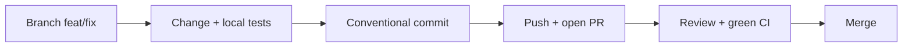

# Developer Guide — From Zero to Contribution

This guide walks a **new developer** from an empty laptop to a first pull request (PR), then stays on the desk as a day-to-day reference. The assumed background is React hooks and basic TypeScript. Modular architecture, dependency injection (DI), and multi-repo setups are explained the first time they appear. The Indonesian twin of this document is `DEVELOPER-GUIDE.md`.

Neighbouring documents:

| Document | Contents | When to read |
| --- | --- | --- |
| `ARCHITECTURE.md` | why the platform is modular and how each mechanism works | when you want the "why" |
| `CONTRACT.md` | hard rules (must/must not); violations get the PR rejected | before and while writing code |
| `DEPLOYMENT-GUIDE.en.md` | image builds, CI, and deployment | when releasing |

## How to Use This Guide

The guide has two parts:

- **Chapters 0–4 — the learning path.** Read them in order. Each chapter is one practical unit with a verifiable outcome.
- **Chapters 5–10 — reference.** Open when needed: conventions, testing, troubleshooting, PR checklist, image build, and living examples.

Every learning-path chapter uses four icons:

| Icon | Meaning |
| --- | --- |
| 🎯 | chapter goal — what you can do once you finish it |
| ✅ | checkpoint — how to prove the chapter worked |
| ⚠️ | common pitfalls — mistakes that happen most often |
| 📖 | concept — the related chapter in `ARCHITECTURE.md` for the "why" |

Cross-references are short: `ARCHITECTURE §4` means §4 of `ARCHITECTURE.md`; `CONTRACT §12.4` means §12.4 of `CONTRACT.md`; `GUIDE §3` means Chapter 3 of this document.

### Prerequisites

| Need | How |
| --- | --- |
| Node.js 22.x | `nvm install 22 && nvm use 22` (or `fnm use 22`); verify with `node -v` |
| npm 10+ | ships with Node; verify with `npm -v` |
| Git | `git --version`; set `git config user.name` and `git config user.email` |
| React hooks + basic TypeScript | background knowledge; no setup needed |
| Docker (optional) | only for the local image build in `GUIDE §9` |
| OS | macOS/Linux native; **Windows requires WSL2** — the repo scripts use `ln -sfn` and POSIX paths |

### Glossary

These nine terms come up constantly. Read them once; come back when you forget.

| Term | Short meaning |
| --- | --- |
| **Container** | The React application shell: boot, config, DI, auth, host routing, layout, and all registries. The container does not know what the modules contain. |
| **Module** | A self-contained business feature package (`user-management`, `module-sample`) that registers its pages, menu, services, and translations through `init(deps)`. |
| **Extension** | A per-client customization package (`web-extension-client-a`): fills slots, overrides routes, adds services — without changing modules. |
| **Slot** | A named "hole" in the UI that a module declares (example: `module-sample.overviewPanel`); an extension fills it with a component. |
| **deps** | One object holding the container's 13 services (`config`, `logger`, `i18n`, `routes`, `slots`, …) handed to every `init(deps)`; the only channel from a module/extension to the container. |
| **manifest** | `manifest.json` in a client repo: client identity, `baseVersion` (an exact pin to the base release), module list, and overrides. |
| **base image** | The Docker image containing the container + modules, built once by the platform team; a client image is built `FROM` that base image. |
| **override** | What an extension does to replace a module's route, label, or logic. Order of effort: slot → route → service wrapper (start with the lightest). |
| **loader map** | The generated file `moduleLoaders.generated.ts` holding each module's dynamic import; a name in `config.modules` must exist here, or boot fails fast. |

---

## Chapter 0 — From Zero to Running

🎯 **Goal:** the app runs on your laptop — the login page renders, the menu matches the module list, and the browser console is clean.

### Step 1 — Set up Node 22 and Git

```bash
nvm install 22 && nvm use 22   # or: fnm use 22
node -v                        # must be v22.x
git --version
```

Every repo uses Node 22. If `node -v` shows another version, the dev server may fail with confusing errors.

### Step 2 — Get the workspace

Two situations:

**A. You are working in this sample workspace** (`modular-web-sample`, flat layout): all folders are already siblings — `web-container`, `web-modules`, `web-extension-client-a`, `web-extension-template`. Skip the clone steps and continue at Step 3.

**B. You are setting up the production repos:** clone the base repo, then clone the extension repo **inside** the base folder:

```bash
mkdir -p ~/works/arsi && cd ~/works/arsi
git clone <repo-arsi-web-base> arsi-web-base
cd arsi-web-base
git clone <repo-arsi-web-client-a> web-extension-client-a
echo "web-extension-*/" >> .git/info/exclude   # keep the extension clone out of the base repo
```

The extension must live **inside** the base folder because two path contracts resolve from there: the symlink `web-container/current-client -> ../web-extension-client-a`, and the extension aliases (`../web-container`, `../web-modules`).

### Step 3 — Install dependencies (order matters)

```bash
(cd web-modules && npm ci)
(cd web-container && npm ci && CLIENT=client-a npm run link:client)
(cd web-extension-client-a && npm ci)
```

The order `web-modules → web-container → extension` matters: `web-modules` is the workspace package the container resolves, and the extension uses both. `CLIENT=client-a npm run link:client` makes the symlink `web-container/current-client` point at `web-extension-client-a` — that is the "active client". Switch clients anytime with `cd web-container && CLIENT=<client> npm run link:client`.

Use `npm ci` (not `npm install`) because lockfiles are committed and must be followed exactly. Re-run `npm ci` after a `git pull` that changed a lockfile.

### Step 4 — (Optional) Set up dev configuration

```bash
cp web-container/.env.example web-container/.env
```

`.env` is gitignored — safe for local experiments. Its contents:

| Env | Meaning |
| --- | --- |
| `VITE_CLIENT` | active client; optional — when empty, the dev server uses the `current-client` symlink |
| `VITE_MODULES` | modules initialized at boot (CSV; default `user-management,product-management,module-sample`) |
| `VITE_API_BASE` | API base URL for module services (example: `https://dummyjson.com`) |
| `VITE_ENABLE_AUDIT_LIVE` | feature flag for the audit feature |
| `VITE_CONFIG_JSON` | full `/config.json` override (JSON object); when set, the envs above are ignored |

The rule: individual envs override the base values in `public/config.json`; `VITE_CONFIG_JSON` wins outright. You never need to edit `public/config.json` per client.

### Step 5 — Start the dev server

```bash
cd web-container
npm run dev          # http://localhost:5173
```

The dev server prints a line like `[dev] client=client-a (sumber: symlink); config.json digenerate dari env`. Make sure the client is the one you expect. `predev` automatically runs `npm run gen:modules` (which builds the loader map); you do not need to run it yourself.

✅ **Chapter 0 checkpoint**

- [ ] `http://localhost:5173` renders the login page with no browser console errors.
- [ ] After login, the sidebar lists the three default modules: `user-management`, `product-management`, `module-sample`.
- [ ] The `[dev]` line in the terminal shows the correct client.

⚠️ **Chapter 0 common pitfalls**

- **Not restarting the dev server** after switching clients or adding a module. The loader map and symlink are read at server start, not on hot reload — stop it (`Ctrl+C`) and run `npm run dev` again.
- **Adding a module without generating the loader map.** `predev`, `pretypecheck`, `pretest`, and `prebuild` run it automatically, but after adding a module outside that flow run `npm run gen:modules`. Never edit `moduleLoaders.generated.ts` by hand — it is generated.
- **Wrong install order** (extension before `web-modules`) makes the resolver fail to find `@arsi/module-*`.
- **`VITE_CLIENT` differing from the symlink.** Config uses `VITE_CLIENT`, but the loaded extension still comes from the symlink; the dev server warns — make both match.

📖 **Concept:** how config is read at boot and why it is runtime, not build-time → `ARCHITECTURE §5–§6`.

---

## Chapter 1 — Guided Codebase Tour

🎯 **Goal:** you have a mental map of the code — which folder is for what, where boot starts, and where modules/extensions register things.

### Step 1 — Learn the key folders

| Folder / file | Contents | Your role |
| --- | --- | --- |
| `web-container/` | Shell: boot (`src/bootstrap/`), `deps` (`src/di/`), host routing, layout, registries | almost always **read-only** (changes need lead approval) |
| `web-modules/shared/` | UI kit and shared utils (`@arsi/shared`) | use it; you may add components |
| `web-modules/modules/<name>/` | One business feature: pages, hooks, services, store, i18n | where you add/change features (`GUIDE §3`) |
| `web-extension-client-a/` | The active client's extension | where client-specific needs are written (`GUIDE §4`) |
| `web-extension-template/` | Template for new client repos | copied when creating a new client |
| `web-extension-default/` | No-op extension to run the base without a client | read-only |
| `docs/` | `ARCHITECTURE`, `CONTRACT`, and this guide | reference |

### Step 2 — Read the leanest module: `module-sample`

Open `web-modules/modules/module-sample/index.tsx` (55 lines). It is the simplest example module, yet every mechanism is there. The key parts:

| Line | What it does |
| --- | --- |
| `:14` | `init(deps)` — the module's only entry point; the container calls it at boot |
| `:20-21` | registers translations (i18n) under the `module-sample` namespace |
| `:23-27` | creates an axios client and registers it as a service named `module-sample` |
| `:29-34` | registers a sidebar menu item |
| `:36-48` | registers page routes (`deps.routes.add`) |
| `:50` | registers a modal |
| `:52-54` | subscribes to a cross-module event |

The pattern never changes: **register, don't build**. A module does not create its own router, i18n, or query client — it calls `deps.*.register(...)`, and the container assembles the UI after every `init` finishes.

### Step 3 — Read the extension: `web-extension-client-a/src/index.tsx`

An extension has the same shape (`init(deps)` at `:33`), but its content is *adjustments* to what already exists:

- `:39-55` — adds/overrides i18n bundles, including the `user-management` menu label "Client A Users".
- `:57-61` — registers a client-specific service with a client-name prefix: `client-a.audit`.
- `:63` — fills the user table slot (`userSlots.userTableActions`) with an audit button.
- `:65-68` — overrides the `/users/:id` route — guarded by `deps.routes.has` so it stays safe when the module is absent.
- `:71` — fills the `sampleSlots.overviewPanel` slot with `ClientASamplePanel`.
- `:93-96` — reacts to the `userEvents.updated` event.

Notice: the extension always **uses** what already exists (module routes, module slots, module public API). Not a single line here changes a module file.

### Step 4 — Keep a "where to start" map

| Want to see... | Open |
| --- | --- |
| App entry point and boot order | `web-container/src/main.tsx:11` |
| The `deps` contract (13 services) | `web-container/src/di/deps.ts:23` |
| A complete module example | `web-modules/modules/module-sample/index.tsx:14` |
| A client extension example | `web-extension-client-a/src/index.tsx:33` |

✅ **Chapter 1 checkpoint**

- [ ] Without opening the guide, you can answer "where are routes registered?" and find `deps.routes.add` at `web-modules/modules/module-sample/index.tsx:36`.
- [ ] You can tell the module role ("provides features") apart from the extension role ("customizes for a client").
- [ ] You know an extension may only import a module's **public API** (`public.ts`), never its internal files.

⚠️ **Chapter 1 common pitfalls**

- **Reading all of `web-container/` first.** Start from `module-sample` then `client-a`; read the container as needed.
- **Assuming modules know each other.** Modules must not import other modules; they communicate through the event bus (`CONTRACT §13`).
- **Looking for a hardcoded module list.** There is none — modules are discovered from `config.modules` through the loader map.
- **Touching module internal files from an extension.** An extension may only import a module's `public.ts` (`CONTRACT §1.4`).

📖 **Concept:** the mental model and every connection mechanism → `ARCHITECTURE §3–§5`; the full dependency rules → `ARCHITECTURE §9` and `CONTRACT §1`.

---

## Chapter 2 — Your First Change

🎯 **Goal:** your first PR — one small change in the `client-a` extension: one i18n string and one slot component, complete with tests, a commit, and a PR description.

The example uses the `client-a` extension because client-specific changes never touch module code. Run every command from `web-extension-client-a/` unless stated otherwise.

### Step 1 — Create a branch

```bash
git checkout -b feat/client-a-panel-copy
```

Branch off the main branch of the right repo: client overrides in the extension repo; modules/shared/container in the base repo. Naming: `feat/<short>` or `fix/<short>`.

### Step 2 — Change one i18n string

Open `web-extension-client-a/src/i18n/id.json` and change the panel title:

```json
"panelTitle": "Panel Klien A",
```

Update `en.json` too (`"panelTitle": "Client A panel"`) so both locales stay in parity. The extension adds translations through `deps.i18n.addResourceBundle` (`src/index.tsx:39-40`) under the `client-a` namespace; components read them with `useTranslation('client-a')`.

### Step 3 — Change one slot component

The component `web-extension-client-a/src/components/ClientASamplePanel.tsx` renders in the `module-sample.overviewPanel` slot — the extension registers it at `src/index.tsx:71`, while the module declares the slot name at `web-modules/modules/module-sample/slots.ts:2`.

Add one line at the end of the `Card`:

```tsx
<p className="mt-2 text-xs text-muted-foreground">{t('sample.panelFooter')}</p>
```

then add the new key to both i18n files:

```json
"panelFooter": "Managed specially for Client A."
```

Save, then open `http://localhost:5173/module-sample` — the panel in the "module-sample.overviewPanel" card changes without a single module file being touched. That is what a slot is for.

### Step 4 — Run tests, typecheck, and lint

```bash
cd web-extension-client-a
npm test
npm run typecheck
npm run lint
```

Run the same commands in whichever repo you changed code in (`web-modules`, `web-container`, or the extension). Make sure all three pass before committing.

### Step 5 — Commit with a conventional message

```bash
git add src/i18n/id.json src/i18n/en.json src/components/ClientASamplePanel.tsx
git commit -m "feat(client-a): add panel footer copy"
```

Commit rules: `feat(<scope>): ...` for features, `fix(<scope>): ...` for fixes. `scope` = the module or client you changed. One commit, one purpose — never mix refactoring with a feature.

### Step 6 — Push and open the PR

```bash
git push -u origin feat/client-a-panel-copy
```

Then open the PR against the right repo (base branch `main`): client override changes → the extension repo; module/shared/container changes → the base repo. The PR description should at least cover: what changed, why, and how to verify it (e.g. "open `/module-sample`, see the panel footer"). The full checklist is in `GUIDE §8`.



✅ **Chapter 2 checkpoint**

- [ ] The PR contains one small change with a description explaining what, why, and how to verify.
- [ ] Tests, typecheck, and lint pass in the affected repo.
- [ ] `git status` is clean of accidental files (`.env`, the `current-client` symlink, `node_modules`).

⚠️ **Chapter 2 common pitfalls**

- **Committing files that must not be committed** — `.env`, the `current-client` symlink, or `node_modules` (all gitignored; if they show up, do not `git add -f`).
- **Forgetting to update `en.json`**, leaving English without the string.
- **Changing module code from the extension repo.** Client needs are solved with slots/routes/service wrappers; module changes go to the base repo as their own PR.
- **Large mixed commits** or vague messages, making review and rollback hard.
- **Force-pushing a shared branch** after review starts — just add another commit.

📖 **Concept:** why an extension can fill slots and override routes without touching modules, and the three override levels → `ARCHITECTURE §4` and `ARCHITECTURE §7`.

---

## Chapter 3 — Creating a New Module

🎯 **Goal:** the `order-management` module appears in the menu, its page renders, and every test passes — without touching container code.

This chapter's case study is the `order-management` module. Two real modules are your references:

- `web-modules/modules/module-sample/` — the leanest skeleton, yet every mechanism is present (`index.tsx`, `public.ts`, `slots.ts`, `events.ts`, `modals.ts`, `queryKeys.ts`, `types.ts`, `i18n/`, `pages/`, `components/`, `hooks/`, `store/`).
- `web-modules/modules/user-management/` — a full CRUD example with a store, hooks, and components.

The main module rule is in `CONTRACT §1`: a module **must not** import another module or an extension. Everything it needs arrives through `deps` at `init(deps)`.

### Step 1 — Create the folder and `package.json`

```bash
cd web-modules/modules
mkdir order-management
```

The resulting structure (relative to the module folder):

```
order-management/
├── package.json
├── index.tsx           # entry init(deps) — called by the container at boot
├── public.ts           # contract for extensions
├── types.ts
├── slots.ts
├── events.ts
├── modals.ts
├── queryKeys.ts
├── services/service.order.ts
├── hooks/useOrder.ts
├── store/useOrderStore.ts
├── components/
├── pages/
└── i18n/{en,id}.json
```

`package.json` copies `module-sample/package.json`; only `name` changes:

```json
{
  "name": "@arsi/module-order-management",
  "version": "0.1.0",
  "private": true,
  "type": "module",
  "sideEffects": false,
  "main": "public.ts",
  "types": "public.ts",
  "peerDependencies": { "react": "^19.0.0", "react-dom": "^19.0.0" },
  "dependencies": {
    "@arsi/shared": "^0.1.0",
    "axios": "~1.7.9",
    "react-router-dom": "^6.30.6",
    "zustand": "^5.0.15"
  }
}
```

`name` **must** follow `@arsi/module-<folder name>`. `npm run gen:modules` validates this convention and fails immediately on a mismatch. `react`/`react-dom` are always `peerDependencies` (`CONTRACT §1.6`).

### Step 2 — Fill in the domain: types, service, and query keys

- `types.ts` — the module's domain types (`Order`, `OrderListResponse`, `CreateOrderInput`).
- `services/service.order.ts` — a **factory function** that receives an `AxiosInstance`; it never touches `deps`, React, or React Query:

```ts
import type { AxiosInstance } from 'axios';
import type { Order, OrderListResponse } from '../types';

export function createOrderService(api: AxiosInstance) {
  return {
    async list(params: { limit?: number; skip?: number } = {}): Promise<OrderListResponse> {
      const { limit = 10, skip = 0 } = params;
      const res = await api.get<OrderListResponse>('/orders', { params: { limit, skip } });
      return res.data;
    },
  };
}

export type OrderService = ReturnType<typeof createOrderService>;
```

- `queryKeys.ts` — the root key **must** be `['<module>', '<entity>']`:

```ts
export const orderKeys = {
  all: ['order-management', 'order'] as const,
  lists: () => [...orderKeys.all, 'list'] as const,
  list: (params?: { limit?: number; skip?: number }) =>
    [...orderKeys.lists(), params ?? {}] as const,
  detail: (id: number) => [...orderKeys.all, 'detail', id] as const,
};
```

A service an extension may need to invalidate **must** be exported through `public.ts`. Full rules: `CONTRACT §4` (service registry) and `CONTRACT §5` (data fetching).

### Step 3 — `index.tsx`: the single `init(deps)` entry point

```tsx
import axios from 'axios';
import type { Deps } from '@arsi/container';

import en from './i18n/en.json';
import id from './i18n/id.json';
import { OrderListPage } from './pages/OrderListPage';

let initialized = false;

export default async function init(deps: Deps): Promise<void> {
  if (initialized) {
    return; // React StrictMode can call init twice
  }
  initialized = true;

  deps.i18n.addResourceBundle('en', 'order-management', en, true, true);
  deps.i18n.addResourceBundle('id', 'order-management', id, true, true);

  const orderClient = axios.create({
    baseURL: deps.config.apiBase,
    timeout: 8000,
  });
  deps.apiRegistry.register('order', orderClient);

  deps.menu.register({
    path: '/orders',
    label: 'menu.orders',
    namespace: 'order-management',
    order: 30,
  });

  deps.routes.add({
    path: '/orders',
    element: <OrderListPage />,
    meta: { group: 'order', module: 'order-management' },
  });
}
```

`init` rules:

- **Every** registration (i18n, service, menu, route, modal, slot, event) happens inside `init`, never at file top level.
- `init` **must be idempotent** — note the `initialized` guard; the container registries throw on duplicate registration.
- The service name follows `CONTRACT §4.6` (module `order-management` → service `order`).
- The axios client is created here only; components get it through hooks, never via `import axios`.

Pages use `@arsi/shared` components and module hooks:

```tsx
export function OrderListPage() {
  const { t } = useTranslation('order-management');
  const { data, isLoading } = useOrderList();
  // PageHeader + DataTable from @arsi/shared
}
```

Hooks compose the service + React Query — always import `useQuery`/`useMutation` from `@arsi/container`:

```ts
import { useMemo } from 'react';
import { useApiRegistry, useQuery } from '@arsi/container';

import { orderKeys } from '../queryKeys';
import { createOrderService } from '../services/service.order';

function useOrderService() {
  const apiRegistry = useApiRegistry();
  return useMemo(() => createOrderService(apiRegistry.get('order')), [apiRegistry]);
}

export function useOrderList() {
  const service = useOrderService();
  return useQuery({ queryKey: orderKeys.list(), queryFn: () => service.list() });
}
```

### Step 4 — `slots.ts`, `events.ts`, `modals.ts`

When a module offers extension points, declare them here:

```ts
// slots.ts — connection points for extensions
export const orderSlots = {
  orderTableActions: 'order-management.orderTableActions',
} as const;

// events.ts — cross-module communication (the module only emits)
export const orderEvents = {
  created: 'order-management.order.created',
} as const;

export interface OrderCreatedPayload {
  id: number;
}

// modals.ts — modals anyone can open through deps.modal
export const orderModals = {
  create: 'order-management.create',
} as const;
```

Naming conventions: slot `<module>.<slotName>`, event `<module>.<entity>.<action>`, modal `<module>.<action>` (`CONTRACT §11`–`§13`). Module components consume a slot with `useSlot`:

```tsx
const Actions = useSlot(orderSlots.orderTableActions);
```

Register the modal and event listener in `init`:

```tsx
deps.modal.register(orderModals.create, CreateOrderDialog);

deps.events.on<OrderCreatedPayload>(orderEvents.created, (payload) => {
  deps.logger.info('order-management: order created', payload);
});
```

### Step 5 — i18n: `i18n/en.json` and `i18n/id.json`

The namespace is the module folder name; keys are descriptive, not `text1`:

```json
{
  "title": "Orders",
  "menu": { "orders": "Orders" },
  "empty": "No orders found"
}
```

Both files are required — ID/EN parity applies to the app too.

### Step 6 — `public.ts`: the contract for extensions

Only what is exported here may be used by an extension:

```ts
export { OrderListPage } from './pages/OrderListPage';
export { useOrderList } from './hooks/useOrder';
export { createOrderService, type OrderService } from './services/service.order';
export { orderKeys } from './queryKeys';
export { orderSlots } from './slots';
export { orderEvents } from './events';
export { orderModals } from './modals';
export type { Order, OrderListResponse, CreateOrderInput } from './types';
```

Anything not exported here is internal — extensions are **forbidden** from importing it (`CONTRACT §1.4`).

### Step 7 — Wiring: loader map, Dockerfile, and `config.modules`

1. Generate the loader map from `web-container`:

```bash
cd web-container
npm run gen:modules
```

`gen:modules` writes `src/bootstrap/moduleLoaders.generated.ts` from every module's `package.json`. **Never** edit the generated file by hand; the pre-hooks (`predev`, `pretypecheck`, `pretest`, `prebuild`) run it automatically.

2. Add the `COPY` line for the new module in the base repo root `Dockerfile`, before `npm ci` (a reminder comment sits there):

```dockerfile
COPY web-modules/modules/order-management/package.json ./web-modules/modules/order-management/
```

3. Run the Dockerfile guard:

```bash
cd web-container
npm run check:dockerfile
```

4. Register the module so it boots. In dev via `VITE_MODULES`/`public/config.json`; in production via `config.modules`. An unlisted module is never `init`ed, so its menu and routes do not exist.

5. Update the workspace lockfile and commit:

```bash
cd web-modules
npm install        # the workspace links @arsi/module-order-management
```

### Step 8 — Tests and verification

A module **must** have tests for its public API (`CONTRACT §17`). At minimum, test `init(deps)`: use a fake `deps` + `vi.resetModules()` so the `initialized` guard does not leak between tests — see `web-modules/modules/module-sample/index.test.ts`. The full playbook is in `GUIDE §6`.

```bash
cd web-modules
npm run typecheck && npm test -- modules/order-management && npm run lint

cd ../web-container
npm run check:dockerfile && npm run typecheck && npm test && npm run build
```

Restart the dev server after adding a module (the loader map is read at start):

```bash
cd web-container
npm run dev
# open http://localhost:5173 → the Orders menu appears
```

✅ **Chapter 3 checkpoint**

- [ ] The sidebar lists Orders and `/orders` renders the module page.
- [ ] The new module's `COPY` line is in the `Dockerfile` and `npm run check:dockerfile` passes.
- [ ] `npm run typecheck && npm test && npm run lint` passes in `web-modules`; an `init` test for the new module exists.
- [ ] The module is listed in `config.modules`/`VITE_MODULES`; boot is clean with no console errors.

⚠️ **Chapter 3 common pitfalls**

- **Forgetting the `COPY` line in the Dockerfile.** Dev works, but the image build fails because `npm ci` cannot find the workspace package. `npm run check:dockerfile` catches it early.
- **Forgetting `npm install` on the lockfile.** The `package-lock.json` change must be committed; without it, `npm ci` in Docker/CI fails.
- **A package name that does not follow `@arsi/module-<folder>`.** `gen:modules` fails with the convention error.
- **Registering something at file top level** instead of inside `init` — a module must have no side effects when imported.
- **Forgetting to restart the dev server or to list the module in `config.modules`.** The loader map is static; an unlisted module is never `init`ed.
- **Editing `moduleLoaders.generated.ts` by hand** — it is generated; changes are lost on regenerate.

📖 **Concept:** how the container discovers and inits modules → `ARCHITECTURE §4`–`§5`; dependency rules → `CONTRACT §1`.

---

## Chapter 4 — Creating an Extension

🎯 **Goal:** the active client's extension customizes the app — fills a slot, overrides a route with a guard, and adds a service — without changing a single module file.

An extension is a `web-extension-client-<x>` repo with one entry: the default export `init(deps)` in `src/index.tsx`. Its real shape lives in `web-extension-client-a/`:

```
web-extension-client-a/
├── manifest.json                # client identity + baseVersion (exact pin)
├── aliases.cjs / tsconfig.json   # aliases to the public.ts of modules in use
└── src/
    ├── index.tsx             # init(deps)
    ├── components/           # client-specific components
    ├── overrides/<module>/   # replacement pages
    ├── hooks/                # service wrappers
    ├── i18n/{en,id}.json     # the client-a namespace
    └── pages/                # client-specific pages
```

`manifest.json` holds `client`, `baseVersion` (exact), `modules`, `shared`, and `overrides`:

```json
{
  "client": "client-a",
  "baseVersion": "0.1.0",
  "modules": { "user-management": "^0.1.0", "module-sample": "^0.1.0" },
  "shared": "^0.1.0",
  "overrides": ["user-management", "module-sample"]
}
```

An extension repo **does not** carry `web-container`/`web-modules`; both come from the base image (`ARCHITECTURE §8`).

Always work from the lightest level. Each level and its nature is explained in `ARCHITECTURE §7`:

| Need | Level | API |
| --- | --- | --- |
| Add a button/column to module UI | 1 — slot | `deps.slots.register` |
| Replace a whole page | 2 — route override | `deps.routes.override` |
| Change a service's business rule | 3 — service wrapper | module factory wrapped in an extension hook |

### Step 1 — Level 1: fill a slot

A module declares a slot in `slots.ts` and exports it in `public.ts` (example: `sampleSlots.overviewPanel`). The extension fills it in `init` (`src/index.tsx:71`):

```tsx
import { sampleSlots } from '@arsi/module-module-sample';

deps.slots.register(sampleSlots.overviewPanel, ClientASamplePanel);
```

- A slot component receives props agreed with the module; check the module's `public.ts` for their type.
- A slot may only be filled once — the second registration throws.
- Slots are **additive**: they add, they do not replace. To change behavior, move to the next level.

### Step 2 — Level 2: route override with a guard

`override` replaces the **whole route entry** (include `meta` again) and throws when the path is not registered. That is why `client-a` uses the `overrideIfPresent` helper (`src/index.tsx:21-31`):

```tsx
function overrideIfPresent(
  deps: Deps,
  path: string,
  definition: Parameters<Deps['routes']['override']>[1],
): void {
  if (!deps.routes.has(path)) {
    deps.logger.warn(`[client-a] route "${path}" belum terdaftar; override dilewati`);
    return;
  }
  deps.routes.override(path, definition);
}
```

In use:

```tsx
overrideIfPresent(deps, '/users/:id', {
  element: <ClientAUserDetail />,
  meta: { group: 'user', module: 'user-management' },
});
```

The guard is **required** for routes of modules that can be disabled (`CONTRACT §12.4`). Without it, disabling a module via `config.modules` makes boot fail with `[routes] cannot override unknown route`. Init order helps: an extension always inits **after** all modules, so `routes.has` is already final. An extension may also add a new route with `deps.routes.add` — include `meta.module`; the pattern is in **Step 4**.

### Step 3 — Level 3: service wrapper

An extension **must not** override core services (`auth`, `user`). The correct pattern: register a new service namespaced as `<client>.<service>` (`src/index.tsx:57-61`):

```tsx
const auditClient = axios.create({ baseURL: '/api/audit-client-a', timeout: 5000 });
deps.apiRegistry.register('client-a.audit', auditClient);
```

When you need to change a module service's logic, wrap its factory in an extension hook — never touch the instance the module registered:

```ts
const service = useMemo(() => {
  const base = createSampleService(apiRegistry.get('module-sample'));
  return {
    ...base,
    async getUser(userId: number) {
      if (userId > 3) throw new Error('client-a: hanya user 1-3 yang boleh diakses');
      return base.getUser(userId);
    },
  };
}, [apiRegistry]);
```

Living example: `web-extension-client-a/src/hooks/useClientASample.ts`. Full rules: `CONTRACT §4`.

### Step 4 — Client-only new feature (route + menu)

Use it when a client need has no counterpart in the base: a page and menu that do not attach to any module. Two registrations, both in `init(deps)` — example from `web-extension-client-a/src/index.tsx:79-91`:

```tsx
deps.routes.add({
  path: '/client-a/reports',
  element: <ClientAReportsPage />,
  meta: { group: 'client-a', module: 'client-a' },
});

deps.menu.register({
  path: '/client-a/reports',
  label: 'menu.reports',
  namespace: 'client-a',
  order: 90,
});
```

- The feature namespace is the client id: path `/<client>/...`, `meta: { group: '<client>', module: '<client>' }`, and an i18n bundle under the `<client>` namespace (the `menu.reports` label lives in client-a's `i18n/{en,id}.json`).
- `web-extension-template` already ships a similar sample that derives the client id from `deps.config.client` at runtime (`src/index.tsx:17-36`, path `/<client>/sample`) — no manual edits. Delete that block if unused.
- ⚠️ Register the route **and** the menu together: the Sidebar renders every item from `menu.getAll()` without filtering (`web-container/src/layout/Sidebar.tsx:16,33-37`), so a menu without a route (or vice versa) confuses users. Route paths **must** be unique — a duplicate throws in the registry.
- ✅ Checkpoint: open `/<client>/...` — the menu appears in the Sidebar and the page renders.
- 📖 Concepts and how it sits beside the three override levels → `ARCHITECTURE §7`; route rules → `CONTRACT §12.4`.

### Step 5 — i18n and events

Two adjustments almost every extension needs:

```tsx
// the client's own namespace
deps.i18n.addResourceBundle('en', 'client-a', en, true, true);

// override a module label (deep merge + overwrite)
deps.i18n.addResourceBundle('en', 'user-management', { title: 'Client A Users' }, true, true);

// listen to a module event (the allowed direction)
deps.events.on<UserUpdatedPayload>(userEvents.updated, (payload) => {
  void deps.queryClient.invalidateQueries({ queryKey: userKeys.detail(payload.id) });
});
```

Both come from `src/index.tsx`: i18n at `:39-55`, event listener at `:93-96`.

Allowed event directions (`CONTRACT §13`):

| Direction | Allowed? |
| --- | --- |
| Module emit → extension listen | ✓ |
| Extension emit → module listen | ✗ (the base must not know about the extension) |
| Extension emit → extension listen | ✓ (namespace `<client>.<entity>.<action>`) |

### Step 6 — Extension tests

Tests for the override are **required**. The pattern in `web-extension-client-a/src/__tests__/init.test.ts`: `createFakeDeps()` + `vi.resetModules()` + dynamic import, then assert the registry calls:

```ts
expect(slots.register).toHaveBeenCalledWith(userSlots.userTableActions, expect.anything());
expect(routes.override).toHaveBeenCalledWith(
  '/users/:id',
  expect.objectContaining({ element: expect.anything() }),
);
```

Verify:

```bash
cd web-extension-client-a
npm run typecheck && npm test && npm run lint
```

The first time an extension imports a module, add the `@arsi/module-<folder>` alias in the extension's `aliases.cjs` + `tsconfig.json` (see `web-extension-client-a/aliases.cjs`).

### Step 7 — See the override in dev

```bash
cd web-container
CLIENT=client-a npm run link:client   # symlink current-client -> ../web-extension-client-a
npm run dev                          # http://localhost:5173
readlink current-client              # make sure it points at the right extension
```

Changes under the extension's `src/` hot-reload; **restart** the dev server when switching clients.

✅ **Chapter 4 checkpoint**

- [ ] The extension's slot/panel appears on the module page without a single module file changing.
- [ ] The route override is visible; with the target module disabled, boot still works and the guard logs a warning.
- [ ] `npm run typecheck && npm test && npm run lint` passes in the extension repo.
- [ ] No core service is overridden; new services are namespaced `client-<x>.<service>`.

⚠️ **Chapter 4 common pitfalls**

- **Overriding an optional module's route without a guard** → boot fails with `[routes] cannot override unknown route` (`CONTRACT §12.4`).
- **Importing a module's internal files** (`pages/...`, `store/...`) instead of `@arsi/module-<folder>` (`public.ts`) — a contract violation.
- **Registering a service under a core name** (`user`, `auth`) — guaranteed collision; always use the client namespace.
- **Forgetting `meta` on an override** — module attribution is lost because the override replaces the whole entry.
- **Touching module code for a client need.** Client needs are solved in the extension; module changes go to the base repo as their own PR.
- **Forgetting to add the module alias** on first override — the extension's typecheck/test fails to resolve.

📖 **Concept:** the three override levels, additive vs invasive, and the optional-module guard → `ARCHITECTURE §7`.

### Creating a new client repo from the template

Used when the folder/repo `web-extension-client-<x>` does not exist yet. Run these from the base repo.

1. Create an empty `arsi-web-client-<x>` repo in the GitHub org (e.g. `satriolangit`).

2. Copy the template — the client folder must be a sibling of `web-container`/`web-modules`:

```bash
cd arsi-web-base
cp -R web-extension-template web-extension-client-<x>
rm -rf web-extension-client-<x>/node_modules
```

3. Adjust the client identity:
   - `package.json`: `name` → `@arsi/extension-client-<x>`.
   - `manifest.json`: `client` → `client-<x>` (e.g. `client-bca`), `baseVersion` → the current base tag (exact, no `^`), then `modules`/`shared`/`overrides` as needed. A wrong pin is rejected by `npm run check:base` during the image build.

4. Make it its own Git repo, then push:

```bash
cd web-extension-client-<x>
git init -b main
git add .
git commit -m "feat: initial extension client-<x>"
git remote add origin <git-url-arsi-web-client-<x>>
git push -u origin main
```

5. Make sure the client folder does not leak into the base repo:
   - The base repo's `.git/info/exclude` contains `web-extension-*/` (created in `GUIDE §0`).
   - Verify: `cd ..` then `git status` must be **clean**, and `git check-ignore -v web-extension-client-<x>/` must point at `.git/info/exclude`.
   - The ignore only applies to **untracked** files; if it was already `git add`ed, remove it with `git rm -r --cached web-extension-client-<x>`. Never use `git add -f`.
   - `web-extension-default/` and `web-extension-template/` are intentionally kept tracked in the base repo.

6. Try it locally (optional):

```bash
cd web-extension-client-<x>
npm ci
cd ../web-container
CLIENT=client-<x> npm run link:client && npm run dev
```

Building & pushing the client image uses `ci/build-client.sh` (the base is not rebuilt); the full steps are in `DEPLOYMENT-GUIDE` Tutorial A/B.

---

## Chapter 5 — Quick Conventions

Open this chapter while writing code. The full rules live in `CONTRACT §15`; this is the summary.

**Routes & queries.** Quick rules when handling URLs:

- Register the route **pattern** (`/users/:id`, never a concrete URL); `has`/`override` match the exact string.
- Read path params with `useParams`; read the query string (`?state=online`) with `useSearchParams`.
- Put filter values into React Query keys (`userKeys.list({ search })`) so the cache stays correct.

### 5.1 Naming

| Aspect | Format | Example |
| --- | --- | --- |
| Module folder | kebab-case | `order-management` |
| Component file | PascalCase | `OrderTable.tsx` |
| Hook file | `use<Name>.ts` | `useOrder.ts` |
| Service file | `service.<name>.ts` | `service.order.ts` |
| Store file | `use<Name>Store.ts` | `useOrderStore.ts` |
| Slot | `<module>.<slotName>` | `order-management.orderTableActions` |
| Modal / Event | `<module>.<action>` / `<module>.<entity>.<action>` | `order-management.create`, `order-management.order.updated` |
| i18n namespace | `<module>` | `order-management` |
| Service name | `<module>` / `<client>.<service>` | `order`, `client-a.audit` |
| Query key root | `[<module>, <entity>]` | `['order-management', 'order']` |
| Store persist key | `module:<name>` / `container:<name>` | `module:order-management` |
| Config file | `.cjs` | `aliases.cjs`, `tailwind.config.cjs` |
| Files containing JSX | `.tsx` | `index.tsx`, `OrderListPage.tsx` |

A module package name **must** be `@arsi/module-<folder>` — `gen:modules` fails immediately on a mismatch.

### 5.2 Module folder structure

The standard skeleton of a module (`GUIDE §3` shows how to create one):

```
order-management/
├── package.json      # name: @arsi/module-order-management
├── index.tsx         # init(deps) — all registrations
├── public.ts         # the only door for extensions
├── types.ts          # domain types
├── slots.ts          # UI extension points
├── events.ts         # cross-module communication
├── modals.ts         # modals that can be opened
├── queryKeys.ts      # query key factory
├── services/         # factory functions, no deps
├── hooks/            # service + React Query
├── store/            # Zustand, persist key module:<name>
├── components/       # module UI components
├── pages/            # route pages
└── i18n/{en,id}.json # namespace = folder name
```

An extension uses a similar structure, plus `overrides/<module>/` for replacement pages (`GUIDE §4`).

### 5.3 Imports: wrong → right

| ✗ | ✓ |
| --- | --- |
| `import axios from 'axios'` in a service/hook | only in `index.tsx` when registering the service |
| `import { useQuery } from '@tanstack/react-query'` | `import { useQuery } from '@arsi/container'` |
| `import { toast } from 'sonner'` | `useToast()` / `deps.toast` |
| `import i18next from 'i18next'` | `useTranslation()` / `deps.i18n` |
| `import { Button } from '@arsi/shared/components/ui/button'` | `import { Button } from '@arsi/shared'` |
| `import { X } from '@arsi/module-user-management/internal'` (extension) | `import { X } from '@arsi/module-user-management'` |
| `import.meta.env.VITE_*` in a module/extension | `deps.config` / `useConfig()` |
| Creating your own `QueryClient` | `useQueryClient()` / `deps.queryClient` |

ESLint enforces most of these rules (`no-restricted-imports` per repo).

### 5.4 i18n

- Module namespace = folder name (`order-management`); extension namespace = client id (`client-a`).
- Every UI string goes through `t()` — never hardcode text.
- Both `i18n/en.json` and `i18n/id.json` are **required**; ID/EN parity applies to the app too.
- Keys are descriptive (`menu.orders`, `empty`), not `text1`.
- An extension may override a module label via `addResourceBundle(..., overwrite=true)` (`GUIDE §4`); full rules in `CONTRACT §6`.

### 5.5 Tailwind styling

Brand: **ARSI Purple `#551AB9`**. Full token table: `CONTRACT §10.4`.

| Rule | Detail |
| --- | --- |
| Colors | **Tokens required** (`bg-primary`, `text-success-strong`); raw hex / direct Tailwind palette colors are forbidden. |
| Hover/selected | `hover:bg-primary-hover` (buttons), `bg-accent` (hover/selected surface). |
| Status | Tint pattern: `bg-success/10 text-success-strong border-success/20` (same for `warning`/`info`/`destructive`). |
| Dark mode | Do not use `dark:` — tokens flip automatically (`web-container/src/styles/globals.css`). |
| Font | Plus Jakarta Sans self-hosted; do not add a Google Fonts `<link>`. |
| New tokens | Edit `globals.css` + `tailwind.preset.cjs`; the test `web-container/src/styles/tokens.test.ts` must pass. |
| Container | Self-contained: the container must not import `@arsi/shared` (ESLint). |

### 5.6 Commit & branch

| Item | Rule |
| --- | --- |
| Branch | `feat/<short>` or `fix/<short>`, from the main branch of the right repo |
| Commit | `feat(<scope>): ...` / `fix(<scope>): ...`; `scope` = module or client |
| Commit content | one purpose — never mix refactoring with a feature |
| Repo | client overrides → extension repo; module/shared/container → base repo |

---

## Chapter 6 — Testing Playbook

Testing requirements live in `CONTRACT §17`: a module **must** test its public API, an extension **must** test its overrides. These are the patterns proven in the sample repos.

### 6.1 Pattern 1 — fake `deps` + `vi.resetModules()`

Testing `init(deps)` does not use the real container. Create a fake `deps` whose registries are `vi.fn()`, then re-import the module so the `initialized` guard is fresh per test:

```ts
async function loadInit() {
  vi.resetModules();                 // the `initialized` guard is false again
  const mod = await import('../index');
  return mod.default;
}

const { deps, apiRegistry, slots, routes } = createFakeDeps(); // fake deps + vi.fn()
await (await loadInit())(deps);

expect(apiRegistry.register).toHaveBeenCalledWith('client-a.audit', expect.anything());
expect(slots.register).toHaveBeenCalledWith(userSlots.userTableActions, expect.anything());
expect(routes.override).toHaveBeenCalledWith('/users/:id', expect.objectContaining({ element: expect.anything() }));
```

Living examples: `web-extension-client-a/src/__tests__/init.test.ts` and `web-modules/modules/module-sample/index.test.ts`. Always add an idempotency test: call `init` twice and assert registrations do not repeat (StrictMode).

### 6.2 Pattern 2 — container registry tests

Registry behavior is tested directly under `web-container/src/` by calling its factory without React:

| Registry | Test file | What it guards |
| --- | --- | --- |
| Route | `routes/routeRegistry.test.ts` | duplicate `add` → throw; `override` of an unknown path → throw |
| Slot | `slots/slotRegistry.test.ts` | slot filled twice → throw |
| Service | `api/apiRegistry.test.ts` | `get` of an unknown name → throw |
| Menu | `menu/menuRegistry.test.ts` | items ordered & unique |
| Event | `events/eventBus.test.ts` | `on`/`emit`/`off` |

These tests protect the error messages you meet in `GUIDE §7`.

### 6.3 Pattern 3 — service & query keys

A service is a factory that receives an `AxiosInstance`, so its test only mocks axios:

```ts
const api = { get: vi.fn(), post: vi.fn() };
const service = createOrderService(api as unknown as AxiosInstance);
await service.list({ limit: 5 });
expect(api.get).toHaveBeenCalledWith('/orders', { params: { limit: 5, skip: 0 } });
```

Query keys are tested as values: the root key is namespaced and its children are stable (`queryKeys.test.ts`).

### 6.4 Pattern 4 — components & contract tests

Components mock `@arsi/container` — only the hooks they use (e.g. `useTranslation` returning `t: (key) => key`). `public.test.ts` guards the `public.ts` contract (slot/modal/event names, query key root, exported functions) — see `module-sample/public.test.ts`.

### 6.5 When unit vs smoke?

| Your change | Minimum verification |
| --- | --- |
| Service/hook/store/component logic | unit tests in the affected repo + `typecheck` + `lint` |
| New module wiring (loader map, Dockerfile, config) | `check:dockerfile`, boot/discover tests, restart dev |
| Base version / `manifest.json` | `check:base` (runs during the image build) |
| Before release / dependency change | local image build + smoke test (`GUIDE §9`) |

Tests run per repo: `cd web-modules && npm test`, `cd web-container && npm test`, `cd web-extension-client-a && npm test`.

---

## Chapter 7 — Troubleshooting

Find the symptom, then follow the fix column. If an error is not listed here, check the relevant `CONTRACT` section and ask the team channel — do not guess.

| Symptom | Cause | Fix |
| --- | --- | --- |
| ``[bootstrap] module "x" is declared in config.modules but is not wired in moduleLoaders.generated.ts (run `npm run gen:modules`)`` | The module is in config but the loader map is stale. | `cd web-container && npm run gen:modules`, restart the dev server; check the package name `@arsi/module-<folder>`. |
| `[routes] cannot override unknown route "<path>"` | The extension overrides a route of a module that is off/not registered. | Wrap the override in a `deps.routes.has` guard + `logger.warn` (`CONTRACT §12.4`); check the exact path. |
| Dev config does not match (wrong client/modules/apiBase) | `.env` and `public/config.json` merged differently than expected. | Individual envs override the `public/config.json` base; `VITE_CONFIG_JSON` wins outright. Check the `[dev]`/`[dev-config]` lines, fix `.env`, restart. |
| `[check:base] baseVersion manifest (x) != base image (y)` | The `manifest.json` pin differs from the built base tag. | Align `baseVersion` with the base tag, or build/use the right base tag (`GUIDE §9`). |
| `npm ci` fails: `can only install packages when your package.json and package-lock.json are in sync` / `Missing: ... from lock file` | The lockfile did not change with it (fresh pull, new dependency/module). | Run `npm install` in the changed repo and commit `package-lock.json`; CI/Docker always uses `npm ci`. |
| `[apiRegistry] service "x" is not registered` | The service is registered in an `init` that has not run, or the name is wrong. | Check the module order in config and the names in `register`/`get` (`CONTRACT §4.6`). |
| `[slots] slot "x" already has a component registered` | The slot was filled twice or `init` re-ran without a guard. | Ensure the `initialized` guard; one slot is for one extension only. |
| `init` runs twice in dev | React StrictMode. | The container already guarantees a single boot via `bootstrapPromise`; modules/extensions still need the `initialized` guard (`GUIDE §3`). |
| Changes do not appear after switching clients | The `current-client` symlink is read at server start. | `readlink web-container/current-client`; re-run `CLIENT=<client> npm run link:client`, restart dev. |
| Colors do not change with the theme | Raw hex or `dark:` utilities in a component. | Replace with tokens (`GUIDE §5.5`); run `tokens.test.ts`. |
| Extension test: `Cannot read properties of null (reading 'useCallback')` | Two React copies (shared/Radix vs extension). | Alias `react`/`react-dom` in the extension's `vitest.config.ts` + `server.deps.inline` for `@arsi/shared` & `@radix-ui`. |
| Docker build fails after adding a module/dependency | The module `package.json` is not COPYed or the lockfile is not committed. | Add the `COPY` line, commit the lockfile, run `cd web-container && npm run check:dockerfile`. |
| `Invalid hook call` / `useNavigate() may be used only in the context of a <Router>` | Two React/React Router copies in the bundle. | Add the library to `resolve.dedupe` in `vite.config.ts` + `vitest.config.ts` (`CONTRACT §1.6`). |
| New module does not appear in the menu | Not listed in `config.modules`/`VITE_MODULES`, or the loader map is stale. | List the module, `npm run gen:modules`, restart dev (`GUIDE §3`). |

---

## Chapter 8 — PR Checklist

Use this before opening a PR. It is the developer's short version; the official checklist is `CONTRACT §20`.

**General**

- [ ] The PR description explains what changed, why, and how to verify.
- [ ] `git status` is clean of `.env`, the `current-client` symlink, `node_modules`.
- [ ] `typecheck`, `test`, `lint` pass in the changed repo.

**Module**

- [ ] Imports only from allowed layers; no imports from other modules.
- [ ] No `deps` access at top level; all registrations inside `init(deps)`.
- [ ] `init` is idempotent (`initialized` guard).
- [ ] Services are factories, do not access `deps`, do not import React/React Query.
- [ ] Service, slot, modal, event, and query key names are namespaced; routes unique + `meta.module`.
- [ ] All UI text goes through i18n (`en` + `id`).
- [ ] UI uses `@arsi/shared`; styling uses tokens (`GUIDE §5.5`).
- [ ] New dependencies follow `CONTRACT §1.6` (react stays a peer, dedupe across trees).
- [ ] `public.ts` updated; wiring (alias/loader map/Dockerfile/config) complete.
- [ ] Tests added (service/query key/store/public API/component as needed).
- [ ] `check:dockerfile` and `build` pass when wiring/build is touched.

**Extension**

- [ ] Only the default export `init(deps)`; all registrations inside it + idempotent.
- [ ] Module imports only from `@arsi/module-<name>` (public API).
- [ ] No core service override; new services named `<client>.<service>`.
- [ ] Route overrides use the `routes.has` guard; `meta` is included.
- [ ] i18n/styling overrides use tokens; only slots declared by the module are filled.
- [ ] Does not listen to other extensions' events; does not make modules listen to extension events.
- [ ] `manifest.json` updated (`client`, `baseVersion`, `modules`, `overrides`).
- [ ] Override tests added; `typecheck`/`test`/`lint` pass.
- [ ] `check:base` passes during the client image build (`GUIDE §9`).

---

## Chapter 9 — Local Image Build & Smoke Test

The closest thing to production: build the base + client images on your laptop, run the container, check `/config.json`. No registry push. This is the summary; full steps are in `DEPLOYMENT-GUIDE` Tutorial A.

### 9.1 Prerequisites

- Docker is running (`docker version`).
- Run from the base repo root (for the base) / the extension repo root (for the client).
- Base and extension use the same `ORG` so the local tags find each other.

### 9.2 Build the base image

```bash
cd arsi-web-base
ORG=<dockerhub-org> VERIFY=1 PUSH=0 ./ci/build-base.sh
```

- `VERIFY=1` runs typecheck/test/lint + `check:dockerfile` + the default base build before the image is built (optional; `VERIFY=0` is faster).
- Result: `docker.io/<org>/arsi-web-base:0.1.0` and `:0.1.0-builder` (version from `web-container/package.json`).
- `PUSH=0` — the image stays local and is used by the next step.

### 9.3 Build the client image

```bash
cd arsi-web-base/web-extension-client-a
ORG=<dockerhub-org> PULL=0 PUSH=0 BUILD_ID=local ./ci/build-client.sh
```

- `PULL=0` = do not pull the base from the registry; use the local image from §9.2.
- Verification + `check:base` + the Vite build run inside the builder image.
- Result: `docker.io/<org>/arsi-web-client-a:local`.

### 9.4 Run & smoke test

```bash
docker run -d --name arsi-local -p 8080:80 \
  -e VITE_MODULES=user-management,product-management,module-sample \
  -e VITE_API_BASE=https://dummyjson.com \
  docker.io/<org>/arsi-web-client-a:local

sleep 2
curl -s http://localhost:8080/config.json                        # client + modules + apiBase
curl -s -o /dev/null -w "%{http_code}\n" http://localhost:8080/  # 200
docker logs arsi-local 2>&1 | grep Generated
docker rm -f arsi-local
```

Checkpoint: `/config.json` carries the client/modules matching the env, the main page returns 200, and the entrypoint log is clean.

### 9.5 Notes

- **Negative `check:base` test**: temporarily set `manifest.json:baseVersion` to `9.9.9` → the build fails with a mismatch message; restore the value.
- **Apple Silicon**: local images are `linux/arm64`; CI/production is usually `linux/amd64` — rely on CI or set the platform.
- Tags, registry, CI, and rollback in detail: `DEPLOYMENT-GUIDE` Tutorial A/B/C.

---

## Chapter 10 — References & Living Examples

### 10.1 Document map

| Document | Contents | When to open |
| --- | --- | --- |
| `ARCHITECTURE.md` | mental model, boot, every mechanism (slot/route/service/event), deployment | when asking "why is it like this" |
| `CONTRACT.md` | hard rules: layers, naming, testing, review | before writing code & during review |
| `DEPLOYMENT-GUIDE.md` | Tutorial A (laptop), B (Ubuntu server), C (Azure CI/CD) | when building/releasing/deploying |
| `GUIDE §1–§4` | learning path from zero to extensions | during onboarding |

Key sections: `CONTRACT §1` (layers), `§4` (services), `§12.4` (override guard), `§17` (testing), `§20` (review checklist); `ARCHITECTURE §4–§8`.

### 10.2 Living examples in code

| Want to see | Open |
| --- | --- |
| Full CRUD module (list/detail/create/edit/delete, filter, pagination) | `web-modules/modules/product-management/` |
| RHF + Zod + i18n validation | `product-management/schemas/productSchema.ts`, `components/ProductForm.tsx` |
| Optimistic cache + rollback | `product-management/hooks/useProduct.ts` |
| Modal with payload (delete confirmation) | `product-management/components/ProductDeleteDialog.tsx` |
| Simple module + slot + every container dependency | `web-modules/modules/module-sample/` |
| 3-level extension (slot → route override → service wrapper) | `web-extension-client-a/src/index.tsx`, `components/ClientASamplePanel.tsx`, `hooks/useClientASample.ts` |
| Extension test (fake deps + idempotency) | `web-extension-client-a/src/__tests__/init.test.ts` |
| Container registries + their tests | `web-container/src/{routes,slots,api,menu,events}/` |
| Shared UI kit | `web-modules/shared/` |
| Topbar global search → container event → module filter | `web-container/src/layout/GlobalSearch.tsx`, `web-container/src/events/containerEvents.ts`, `product-management/events/containerSearch.ts` |
| Notification bell (module/extension → container) | `web-container/src/notifications/`, `user-management/components/SendNotificationButton.tsx`, `web-extension-client-a/src/components/AuditButton.tsx` |

### 10.3 "Want to know X? Open where?"

| Question | Short answer |
| --- | --- |
| Where are routes/menu registered? | Module `init(deps)` — `deps.routes.add`, `deps.menu.register` (`GUIDE §1`) |
| Why does my module not boot? | Check `config.modules` + the loader map (`GUIDE §7`) |
| How do I replace a module page? | Route override with a guard (`GUIDE §4`, `ARCHITECTURE §7`) |
| How do I change a module service's logic? | Service wrapper in the extension (`GUIDE §4`) |
| How do I add a new module? | `GUIDE §3` |
| How do I release? | `DEPLOYMENT-GUIDE` Tutorial A/B/C |

### 10.4 After this guide

- Read `CONTRACT §20` before your first review.
- Trace one real execution flow from `ARCHITECTURE §3.6`.
- Follow your first release through `DEPLOYMENT-GUIDE` Tutorial A.
